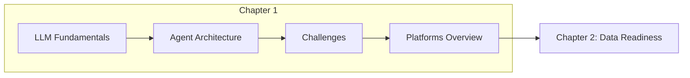

<div align="center">
  

  # Chapter 1: The Challenge of LLM Application Development
</div>

---

## Chapter Overview

This introductory chapter sets the foundation for understanding the unique complexities of building and deploying applications powered by Large Language Models (LLMs). It prepares you for subsequent discussions of LLMOps and the behind-the-scenes work required to manage the entire lifecycle of LLMs in production.

## Learning Objectives

Upon completing this chapter, you will be able to:

- **Define LLMs and foundation models** - Understand the "Large, Language, Model" characteristics and how multimodal foundation models differ from text-only LLMs
- **Compare SLMs vs LLMs** - Evaluate when to use small language models versus large language models based on task requirements, latency, and cost
- **Understand GenAI agents** - Identify the four key components of agents: Model, Tools, Orchestration, and Runtime
- **Apply context engineering techniques** - Implement prompt engineering, system instructions, RAG, and controlled generation
- **Navigate development challenges** - Address data quality, hallucinations, evaluation, and explainability challenges
- **Plan for deployment and maintenance** - Anticipate infrastructure, security, drift, and monitoring requirements

## Prerequisites

Before exploring Chapter 1 resources, ensure you have:

**Required:**
- Google Cloud account with billing enabled ([Create account](https://cloud.google.com/free))
- Project with Vertex AI API enabled ([Enable API](https://console.cloud.google.com/flows/enableapi?apiid=aiplatform.googleapis.com))

**Recommended:**
- Basic Python knowledge (for Colab notebooks)
- Familiarity with Jupyter/Colab environments
- Understanding of REST APIs (helpful but not required)

**For Local Development:**
- Python 3.10+ installed
- `pip install google-genai` (Google Gen AI SDK)
- Google Cloud authentication configured ([Setup guide](https://cloud.google.com/docs/authentication/provide-credentials-adc))

> **New to Google Cloud?** Start with the [Introduction to Generative AI](https://www.coursera.org/learn/introduction-to-generative-ai) course below to build foundational knowledge.

## Key Concepts

### What is an LLM?

| Component | Description |
|-----------|-------------|
| **Large** | Trained on enormous datasets containing billions or trillions of tokens |
| **Language** | Primary focus on understanding and generating human language |
| **Model** | Neural network using transformer architecture with attention mechanisms |

### SLM vs LLM Comparison

| Feature | Small Language Model (SLM) | Large Language Model (LLM) |
|---------|---------------------------|---------------------------|
| Parameters | Millions to hundreds of millions | Billions to trillions |
| Latency | Very low, near-instantaneous | Higher, but streamable |
| Use Case | Narrow, well-defined tasks | Versatile, general-purpose |
| Resources | Mobile/edge deployable | Requires GPU/TPU infrastructure |

### Agent Components

```
┌─────────────────────────────────────────────────────────┐
│                     AGENT RUNTIME                       │
│  ┌─────────────────────────────────────────────────┐   │
│  │              ORCHESTRATION                       │   │
│  │  ┌─────────┐    ┌────────┐    ┌─────────────┐  │   │
│  │  │  MODEL  │◄──►│ MEMORY │◄──►│   TOOLS     │  │   │
│  │  │  (LLM)  │    │ STATE  │    │   (APIs)    │  │   │
│  │  └─────────┘    └────────┘    └─────────────┘  │   │
│  └─────────────────────────────────────────────────┘   │
└─────────────────────────────────────────────────────────┘
```

### Context Engineering Strategies

| Strategy | Description |
|----------|-------------|
| **Prompt Engineering** | Crafting effective inputs (zero-shot, few-shot, chain-of-thought) |
| **System Instructions** | Persistent rules defining model identity and behavior |
| **RAG** | Grounding responses in external, verified data sources |
| **Controlled Generation** | Enforcing output structure and format (e.g., JSON schemas) |

## Chapter Challenges Overview

The chapter addresses three categories of challenges:

### Development Challenges
- Data quality, scale, and privacy
- Model selection and prompt engineering
- Hallucinations and explainability
- Evaluation beyond simple metrics

### Deployment Challenges
- Infrastructure and resource optimization
- Integration with enterprise systems
- Security (prompt injection, adversarial attacks)
- Cost management

### Maintenance Challenges
- Model and data drift
- Continuous monitoring
- Version control for models, prompts, and data

## Learning Resources

This chapter is conceptual and designed to prepare you for hands-on work in subsequent chapters. Explore these curated resources to deepen your understanding.

### Recommended Courses

| Course | Platform | Description |
|--------|----------|-------------|
| [Introduction to Generative AI](https://www.coursera.org/learn/introduction-to-generative-ai) | Coursera | Free introductory course on GenAI fundamentals, model types, and applications |
| [Google AI Essentials](https://www.coursera.org/specializations/ai-essentials-google) | Coursera | Productivity-focused specialization for daily work tasks |
| [Google Prompting Essentials](https://www.coursera.org/specializations/prompting-essentials-google/) | Coursera | Hands-on "5 steps of effective prompting" for text, data, and multimodal tasks |

### Video Tutorials

| Video | Topic |
|-------|-------|
| [Introduction to Artificial Intelligence](https://www.youtube.com/watch?v=bknUn7yMwNI) | How AI, ML, and GenAI differ and automate cognitive tasks |
| [Introduction to Responsible AI](https://www.youtube.com/watch?v=w_3L1Bf2P_g) | Google's three core AI principles |
| [Intro to AI Agents](https://www.youtube.com/watch?v=ZZ2QUCePgYw) | Agentic architecture, tool usage, and autonomous reasoning |
| [Prompt Engineering for Developers](https://www.youtube.com/watch?v=I0DBxnTlaMw) | "Persona, Task, Context" framework and Chain of Thought |
| [How to use RAG](https://www.youtube.com/watch?v=oVtlp72f9NQ) | Embeddings and vector databases for grounding LLM responses |
| [Intro to Multimodal RAG](https://www.youtube.com/watch?v=fownOApoL-A) | Building RAG systems that reason across text and images |

### Hands-On Notebooks

#### Start Here: Local Warm-Up Notebook

Before exploring official notebooks, validate your setup with our quick environment check:

| Notebook | Description | Concepts |
|----------|-------------|----------|
| [01_getting_started.ipynb](colabs/01_getting_started.ipynb) | **Quick start**: Verify Vertex AI connection and make your first Gemini 3 API call | Model initialization, basic prompting, thinking levels |

**How to Run:**
1. Open in [Google Colab](https://colab.research.google.com/github/ayoisio/genai-on-google-cloud/blob/main/chapter-1/colabs/01_getting_started.ipynb) (click the badge in the notebook)
2. Authenticate when prompted (`auth.authenticate_user()` runs automatically)
3. Update `PROJECT_ID` in the configuration cell with your Google Cloud project ID
4. Run all cells (Runtime → Run all)

#### Fundamentals: Gemini 3 Getting Started

Master the basics with official Google Cloud notebooks:

| Notebook | Description | Chapter Concepts |
|----------|-------------|------------------|
| [Intro to Gemini 3 Flash](https://github.com/GoogleCloudPlatform/generative-ai/blob/main/gemini/getting-started/intro_gemini_3_flash.ipynb) | Fast, efficient model with thinking capabilities | **Model selection** (Chapter: SLM vs LLM tradeoffs) |
| [Intro to Gemini 3 Pro](https://github.com/GoogleCloudPlatform/generative-ai/blob/main/gemini/getting-started/intro_gemini_3_pro.ipynb) | Advanced reasoning for complex problems | **Reasoning models** (Chapter: step-by-step thinking) |
| [Intro to Gemini 3 Image Gen](https://github.com/GoogleCloudPlatform/generative-ai/blob/main/gemini/getting-started/intro_gemini_3_image_gen.ipynb) | Image generation and multi-turn editing | **Multimodal foundation models** (Chapter: text, images, video) |
| [Intro to Gen AI SDK](https://github.com/GoogleCloudPlatform/generative-ai/blob/main/gemini/getting-started/intro_genai_sdk.ipynb) | Google Gen AI SDK for Python fundamentals | **Platform integration** (Chapter: deployment challenges) |
| [Intro to Gemini Chat](https://github.com/GoogleCloudPlatform/generative-ai/blob/main/gemini/getting-started/intro_gemini_chat.ipynb) | Chat prompts with Gen AI SDK and LangChain | **Memory and state** (Chapter: agent orchestration) |

> **Browse all**: [GoogleCloudPlatform/generative-ai/gemini/getting-started](https://github.com/GoogleCloudPlatform/generative-ai/tree/main/gemini/getting-started)

#### Deep Dives: Context Engineering

Apply advanced techniques from the chapter's context engineering strategies:

| Notebook | Description | Chapter Concepts |
|----------|-------------|------------------|
| [Intro to Prompt Design](https://github.com/GoogleCloudPlatform/generative-ai/blob/main/gemini/prompts/intro_prompt_design.ipynb) | Zero-shot, few-shot, and chain-of-thought prompting techniques | **Prompt engineering** (Chapter: crafting effective inputs) |
| [Intro to Controlled Generation](https://github.com/GoogleCloudPlatform/generative-ai/blob/main/gemini/controlled-generation/intro_controlled_generation.ipynb) | Enforcing JSON schemas and structured output formats | **Controlled generation** (Chapter: output structure guarantees) |
| [Intro to Function Calling](https://github.com/GoogleCloudPlatform/generative-ai/blob/main/gemini/function-calling/intro_function_calling.ipynb) | Connecting LLMs to external APIs and tools | **Agent tools** (Chapter: bridging LLM capabilities to real world) |
| [Build a DIY ReAct Agent](https://github.com/GoogleCloudPlatform/generative-ai/blob/main/gemini/function-calling/intro_diy_react_agent.ipynb) | Implement reasoning + action agent architecture from scratch | **Agent orchestration** (Chapter: ReAct, planning, tool selection) |

> **Next Chapter Preview**: Chapter 2 introduces **RAG (Retrieval-Augmented Generation)** for grounding LLMs with external data—a critical context engineering strategy for production systems.

## Chapter Roadmap



## What's Next

In **Chapter 2**, you'll dive into preparing for LLM experimentation through data readiness and accessibility—a critical foundation for successful LLM applications including RAG implementation.

---

[Home](../) | [Next Chapter: Data Readiness →](../chapter-2/)
