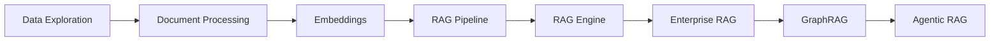

<div align="center">
  

  # Chapter 2: Data Readiness and Accessibility
</div>

---

## Overview

This chapter covers the foundational data readiness concepts required for building production-grade LLM applications on Google Cloud:

- **Data Readiness Dimensions**: Discoverability, accessibility, quality, format, governance
- **Unified Data Platform**: BigQuery, Cloud Storage, Vertex AI, Dataplex
- **Document Processing**: Extracting structured data from unstructured documents
- **RAG Evolution**: From Naive RAG → Advanced RAG → Agentic RAG
- **Vector Search**: Embeddings, indexing, and semantic search
- **GraphRAG**: Knowledge graphs for enhanced retrieval with Spanner Graph
- **Enterprise RAG**: Production-ready patterns with BigQuery and Cloud SQL
- **Security & Governance**: DLP, access controls, and data protection

## Learning Objectives

Upon completing this chapter's exercises, you will be able to:
- Explore and assess data quality using BigQuery
- Process unstructured documents with Document AI
- Generate text embeddings and perform semantic search
- Build a complete RAG pipeline with context assembly
- Use Vertex AI RAG Engine for managed retrieval-augmented generation
- Build an Enterprise RAG Knowledge Engine with BigQuery and Cloud SQL
- Implement GraphRAG with Spanner Graph for structured knowledge retrieval
- Create Agentic RAG applications with MCP and ADK

### Learning Path



## Key Concepts Deep Dive

### RAG Evolution: Three Stages

This chapter guides you through the evolution of RAG systems from prototype to production:

**1. Naive RAG** (Notebooks 01-05)
- Basic retrieval pipeline: chunk → embed → search → assemble → generate
- **Critical insight**: Production Naive RAG requires metadata filtering ("things not strings")
- **Pain point**: DIY RAG consumes 60-70% of project timeline; systems crash under production load

**2. Advanced RAG** (Notebooks 06-07)
- **GraphRAG**: Solves semantic confusion by retrieving relationships, not just documents
  - Example: "interest rate" has different meanings across mortgage vs. credit card databases
  - Uses Knowledge Graphs (Spanner) + vector search for relationship traversal
- **Enterprise patterns**: Cloud SQL pgvector + HNSW for sub-100ms latency, hybrid search

**3. Agentic RAG** (Notebook 08)
- Multiagent architecture with specialized retrievers for different data sources
- Coordinator orchestrates: planning → delegation → specialized retrieval → synthesis
- Uses "operational brain" (Spanner, AlloyDB) for agent memory and state
- **Production pattern**: Separates data-readiness work from agent-reasoning work

### Data Readiness Dimensions

Six interconnected components that determine LLM success:

| Dimension | What It Means | Covered In |
|-----------|---------------|------------|
| **Discoverability** | Finding data across scattered systems (data maps, ownership, freshness) | Notebook 01 |
| **Accessibility** | Delivering the right data to the right people at the right time | All notebooks |
| **Quality** | Consistency, cleanliness, no "data voids" that cause hallucinations | Notebooks 01, 04 |
| **Format** | Layout-aware parsing (Document AI), structured extraction | Notebook 02 |
| **Governance** | Ownership, standards, DLP, prompt management as data assets | Notebooks 06-08 |
| **Security** | Access controls, fine-grained permissions, audit trails | Notebooks 06-08 |

> **Key insight from chapter**: These dimensions are interconnected—governance improvements enhance security AND discoverability. You can't optimize one in isolation.

### Production RAG Patterns (from Chapter Text)

**Metadata Filtering is Non-Negotiable**
- Vector search finds semantically similar content
- Metadata filters ensure retrieved content is *relevant* (date ranges, permissions, document types)
- **Pattern**: "things not strings" - combine structured filters with semantic search

**Hybrid Search for Enterprise**
- Semantic search (vector-based) finds conceptually similar content
- Keyword search (token-based) ensures exact term matches
- **Best practice**: Combine both approaches and re-rank results (see notebook 06)

**The pgvector + HNSW Pattern**
- Cloud SQL PostgreSQL with pgvector extension
- HNSW (Hierarchical Navigable Small World) index for sub-100ms vector search
- Co-locates vector data with operational/business data for hybrid queries
- **Use case**: Enterprise RAG requiring SQL joins + vector search (notebook 06)

**GraphRAG Solves Semantic Confusion**
- Example: "Where can I freshen up?"
  - Vector-only: Returns "Public Showers" AND "L'Occitane en Provence" (semantically similar but wrong)
  - GraphRAG: Returns "Public Showers" → graph traversal → "Restroom" → "Family Restroom" (relationship-aware)
- **Pattern**: Vector search finds initial entities → graph traversal finds related entities → enriched context

### Personas and Roles (from Chapter Text)

Different roles approach data readiness differently:

| Persona | Focus | Key Contribution |
|---------|-------|------------------|
| **Data Scientists** | Discovery, wrangling, experimentation | Find data, prototype chunking strategies, iterate on embeddings |
| **Data Engineers** | Infrastructure, pipelines, storage | Build scalable data foundations, optimize vector stores |
| **ML Engineers** | Model performance, optimization | Measure how data affects model outputs, build retraining triggers |
| **DevOps/SecOps/SRE** | CI/CD, reliability, monitoring | Close prototype-to-production gap, operationalize data pipelines |
| **Business SMEs** | Domain knowledge, governance | Define semantic meaning ("interest rate" isn't one thing), prevent bias |

> **Chapter insight**: Low-maturity organizations keep technical teams and SMEs separate → "pilot purgatory." High-maturity orgs embed SMEs in development lifecycle → production success.

## Notebooks

### Foundations: Data Readiness & Naive RAG

Build the foundation for production RAG systems with data discovery, processing, and basic retrieval patterns.

| # | Notebook | Description | Time | Chapter Concepts |
|---|----------|-------------|------|------------------|
| 1 | [01_data_exploration_bigquery.ipynb](colabs/01_data_exploration_bigquery.ipynb) | Data discovery and quality assessment with BigQuery | ~10 min | **Data readiness dimensions** (Chapter: discoverability, accessibility, quality) |
| 2 | [02_document_processing.ipynb](colabs/02_document_processing.ipynb) | Document AI and structured extraction | ~15 min | **Format dimension** (Chapter: layout-aware parsing, semantic extraction) |
| 3 | [03_embeddings_vector_search.ipynb](colabs/03_embeddings_vector_search.ipynb) | Text embeddings and semantic search | ~15 min | **Naive RAG - Stage 2** (Chapter: embedding generation, vector indexing) |
| 4 | [04_rag_context_assembly.ipynb](colabs/04_rag_context_assembly.ipynb) | Building a complete RAG pipeline | ~15 min | **Naive RAG - Stage 4** (Chapter: context assembly, metadata filtering) |
| 5 | [05_vertex_ai_rag_engine.ipynb](colabs/05_vertex_ai_rag_engine.ipynb) | Managed RAG with Vertex AI RAG Engine | ~15 min | **DIY vs managed trade-off** (Chapter: reducing operational overhead) |

### Advanced RAG Patterns: GraphRAG & Agentic Systems

Move beyond basic retrieval to enterprise patterns with relationship-aware search and multi-agent orchestration.

| # | Notebook | Description | Time | Chapter Concepts |
|---|----------|-------------|------|------------------|
| 6 | [06_enterprise_rag_knowledge_engine.ipynb](colabs/06_enterprise_rag_knowledge_engine.ipynb) | Enterprise RAG with BigQuery ML, Cloud SQL pgvector, and ADK | ~45 min | **Enterprise RAG Knowledge Engine** (Chapter: pgvector + HNSW, hybrid search, sub-100ms latency) |
| 7 | [07_graph_rag_spanner.ipynb](colabs/07_graph_rag_spanner.ipynb) | GraphRAG with Spanner Graph and Vertex AI Agent Engine | ~45 min | **GraphRAG** (Chapter: relationship retrieval, solving semantic confusion, KG + vector search) |
| 8 | [08_agentic_rag_mcp_adk.ipynb](colabs/08_agentic_rag_mcp_adk.ipynb) | Agentic RAG with Model Context Protocol and ADK | ~30 min | **Agentic RAG** (Chapter: multiagent orchestration, specialized retrievers, planning + memory) |

### Optional: Healthcare Workflow Project (Future Enhancement)

**⚠️ NOT YET IMPLEMENTED** - The chapter text describes healthcare multiagent examples (FHIR, DICOM, specialized retrievers) but these notebooks don't exist yet. If created, they would demonstrate:

- **09a_healthcare_graphrag_setup**: Spanner Graph schema for patient knowledge graphs
- **09b_healthcare_data_population**: FHIR data population and metadata indexing
- **09c_healthcare_agents**: Specialized agents for structured EHR vs unstructured documents
- **09d_healthcare_orchestrator**: Coordinator orchestrating multiagent workflow

> **If implementing this project**: Follow the pattern from Chapter text Figure 2-12 ("The Agentic RAG workflow") combining Spanner Graph (operational brain), specialized retrievers for different data sources (FHIR, DICOM, PDFs), and multiagent orchestration with ADK/MCP.

## Official Google Cloud Notebooks

Supplement your learning with official notebooks from Google Cloud Platform's generative-ai repository.

### RAG Fundamentals

Deepen your understanding of managed RAG patterns and evaluation frameworks:

| Notebook | Description | Complements |
|----------|-------------|-------------|
| [Intro RAG Engine](https://github.com/GoogleCloudPlatform/generative-ai/blob/main/gemini/rag-engine/intro_rag_engine.ipynb) | Foundational RAG using Vertex AI RAG Engine with Gemini | Local notebook 05 |
| [RAG Engine Evaluation](https://github.com/GoogleCloudPlatform/generative-ai/blob/main/gemini/rag-engine/rag_engine_evaluation.ipynb) | Retrieval quality metrics and optimization using BEIR dataset | Local notebook 05 (evaluation patterns) |
| [RAG with BigQuery](https://github.com/GoogleCloudPlatform/generative-ai/blob/main/gemini/use-cases/retrieval-augmented-generation/rag_with_bigquery.ipynb) | Complete RAG pipeline using BigQuery as data backend | Local notebooks 01, 06 |
| [RAG Vector Embedding in BigQuery](https://github.com/GoogleCloudPlatform/generative-ai/blob/main/gemini/use-cases/retrieval-augmented-generation/rag_vector_embedding_in_bigquery.ipynb) | Generate embeddings within BigQuery using ML functions | Local notebooks 01, 06 |

### Embeddings & Vector Search

Master semantic search patterns and hybrid retrieval:

| Notebook | Description | Complements |
|----------|-------------|-------------|
| [Vector Search Quickstart](https://github.com/GoogleCloudPlatform/generative-ai/blob/main/embeddings/vector-search-quickstart.ipynb) | Quick intro to Vertex AI embeddings and semantic search | Local notebook 03 |
| [Intro Text Embeddings & Vector Search](https://github.com/GoogleCloudPlatform/generative-ai/blob/main/embeddings/intro-textemb-vectorsearch.ipynb) | Comprehensive guide to text embeddings in BigQuery | Local notebook 03 |
| [Hybrid Search](https://github.com/GoogleCloudPlatform/generative-ai/blob/main/embeddings/hybrid-search.ipynb) | **Critical for production**: Combining semantic + keyword search | Local notebook 06 (enterprise pattern) |
| [Multimodal Embeddings](https://github.com/GoogleCloudPlatform/generative-ai/blob/main/embeddings/intro_multimodal_embeddings.ipynb) | Text and image embeddings for cross-modal search | Advanced multimodal patterns |

### Document Processing

Learn advanced document extraction for RAG knowledge bases:

| Notebook | Description | Complements |
|----------|-------------|-------------|
| [Document Processing with Gemini](https://github.com/GoogleCloudPlatform/generative-ai/blob/main/gemini/use-cases/document-processing/document_processing.ipynb) | Multimodal document processing without OCR preprocessing | Local notebook 02 |
| [Specialized Form Parser](https://github.com/GoogleCloudPlatform/documentai-notebooks/blob/master/specialized/specialized_form_parser.ipynb) | Enterprise form processing with Document AI specialized processors | Local notebook 02 (production patterns) |
| [Invoice Processing Codelab](https://codelabs.developers.google.com/codelabs/pdai-invoices-notebook) | Practical invoice/receipt extraction with confidence scoring | Local notebook 02 (real-world example) |

### Advanced Patterns

Explore multimodal RAG, evaluation, and enterprise architectures:

| Notebook | Description | Complements |
|----------|-------------|-------------|
| [Intro Multimodal RAG](https://github.com/GoogleCloudPlatform/generative-ai/blob/main/gemini/use-cases/retrieval-augmented-generation/intro_multimodal_rag.ipynb) | Foundation for RAG with text and image embeddings | Advanced RAG patterns |
| [Multimodal RAG with LangChain](https://github.com/GoogleCloudPlatform/generative-ai/blob/main/gemini/use-cases/retrieval-augmented-generation/multimodal_rag_langchain.ipynb) | Complete multimodal RAG with LangChain framework integration | Local notebook 08 |
| [Gen AI Evaluation Service](https://github.com/GoogleCloudPlatform/generative-ai/blob/main/gemini/evaluation/evaluate_rag_gen_ai_evaluation_service_sdk.ipynb) | Framework for evaluating RAG answer quality beyond retrieval metrics | All notebooks (evaluation strategy) |

### GraphRAG Documentation

| Resource | Description | Complements |
|----------|-------------|-------------|
| [GraphRAG Architecture with Spanner](https://cloud.google.com/architecture/gen-ai-graphrag-spanner) | Reference architecture combining graph queries + vector search | Local notebook 07 |
| [Spanner Graph with LangChain Blog](https://cloud.google.com/blog/products/databases/using-spanner-graph-with-langchain-for-graphrag) | Integration guide for LangChain + Spanner Graph | Local notebook 07 |

> **Browse all official notebooks**: [GoogleCloudPlatform/generative-ai](https://github.com/GoogleCloudPlatform/generative-ai)

## Prerequisites

Before running the notebooks, ensure you have:

### 1. Google Cloud Project
- A Google Cloud project with billing enabled
- Project ID noted for configuration
- Estimated costs: ~$5-20 for all notebooks (depends on data volume and API usage)

### 2. Enable Required APIs
```bash
gcloud services enable \
    aiplatform.googleapis.com \
    bigquery.googleapis.com \
    bigquerystorage.googleapis.com \
    storage.googleapis.com \
    documentai.googleapis.com \
    sqladmin.googleapis.com \
    spanner.googleapis.com \
    bigqueryconnection.googleapis.com
```

### 3. IAM Permissions
Ensure your account has the following roles:
- `roles/bigquery.dataEditor` - For BigQuery operations (notebooks 01, 06)
- `roles/bigquery.jobUser` - For running queries
- `roles/aiplatform.user` - For Vertex AI (all notebooks)
- `roles/storage.objectViewer` - For Cloud Storage access
- `roles/cloudsql.admin` - For Cloud SQL operations (notebooks 06, 08)
- `roles/spanner.databaseAdmin` - For Spanner Graph (notebook 07)
- `roles/documentai.apiUser` - For Document AI (notebook 02)

### 4. Vector Database Selection (Advanced)

**For notebooks 06-08**, you'll work with different vector storage options. Use this decision matrix:

| Use Case | Recommended Solution | Why |
|----------|---------------------|-----|
| **Learning RAG basics** | Vertex AI RAG Engine (notebook 05) | Fully managed, minimal setup |
| **Enterprise hybrid search** | Cloud SQL pgvector (notebook 06) | SQL + vector search, ACID compliance |
| **Graph + vector queries** | Spanner Graph (notebook 07) | Global scale, relationship traversal |
| **Analytics + embeddings** | BigQuery vector search (notebooks 01, 06) | Unified analytics and vector ops |
| **Ultra-low latency (<10ms)** | AlloyDB + ScaNN | Production-grade performance |

> **Note**: Chapter text includes comprehensive comparison table (Table 2-1) covering max vectors, latency, consistency, and access control for all Google Cloud vector storage options.

### 5. Understanding Data Readiness

This chapter introduces the **6 dimensions of data readiness** for LLMs:

1. **Discoverability** - Finding data across scattered systems
2. **Accessibility** - Delivering the right data to the right people
3. **Quality** - Consistency and cleanliness for LLM consumption
4. **Format** - Proper preprocessing and structure
5. **Governance** - Ownership, standards, DLP, access controls
6. **Security** - Control and access mechanisms

> **Key insight from chapter**: "Data preparation can consume up to 80% of total effort in AI projects" - these notebooks teach production-ready patterns to manage this complexity.

## Quick Start

1. **Open in Colab**: Click the "Open in Colab" badge at the top of each notebook
2. **Authenticate**: Run the authentication cell when prompted
3. **Set Project ID**: Enter your Google Cloud project ID in the configuration cell
4. **Run All Cells**: Execute cells in order from top to bottom

## Directory Structure

```
chapter-2/
├── README.md                 # This file
├── colabs/                   # Jupyter notebooks
│   ├── 01_data_exploration_bigquery.ipynb
│   ├── 02_document_processing.ipynb
│   ├── 03_embeddings_vector_search.ipynb
│   ├── 04_rag_context_assembly.ipynb
│   ├── 05_vertex_ai_rag_engine.ipynb
│   ├── 06_enterprise_rag_knowledge_engine.ipynb
│   ├── 07_graph_rag_spanner.ipynb
│   └── 08_agentic_rag_mcp_adk.ipynb
├── data/
│   └── sample_documents/     # Sample files for exercises
└── solutions/                # Exercise solutions
```

## Sample Data

The notebooks use two data sources:

1. **BigQuery Public Datasets**: Pre-loaded datasets for immediate experimentation
   - `bigquery-public-data.samples.wikipedia`
   - `bigquery-public-data.patents_view.patent`

2. **Sample Documents**: Located in `data/sample_documents/` for document processing exercises

## Troubleshooting

### Authentication Issues
```python
# If authentication fails, try:
from google.colab import auth
auth.authenticate_user()
```

### Quota Errors
- Check your project quotas in the Cloud Console
- Consider using a different region if `us-central1` is at capacity

### Permission Denied
- Verify API is enabled: `gcloud services list --enabled`
- Check IAM roles: `gcloud projects get-iam-policy PROJECT_ID`

## Related Resources

### Vector Database Selection

For deep dive into choosing the right vector storage, see **Chapter 2 Table 2-1** in the source text, which compares:
- **Operational databases**: AlloyDB, BigTable, Cloud SQL (PostgreSQL/MySQL), Firestore, Memorystore, Spanner
- **Analytical databases**: BigQuery
- **Special-purpose**: Vertex AI Vector Search

Key comparison dimensions:
- Max vectors per search space (ranges from 50k to 10 billion+)
- Latency (<3ms for Memorystore to ~1 sec for BigQuery batch)
- Consistency (Strong vs Eventual)
- Hybrid search support (filtered queries combining SQL + vector ops)
- ANN index support (IVF, HNSW, ScaNN, TreeAH)

> **Decision guide**: Use Cloud SQL pgvector for enterprise hybrid search (notebook 06), Spanner for global-scale graph + vector (notebook 07), BigQuery for analytics + embeddings (notebooks 01, 06).

### Official Documentation
- [Vertex AI RAG Engine Overview](https://cloud.google.com/vertex-ai/generative-ai/docs/rag-engine/rag-overview)
- [BigQuery Vector Search Introduction](https://cloud.google.com/bigquery/docs/vector-search-intro)
- [Spanner Graph Documentation](https://cloud.google.com/spanner/docs/graph/overview)
- [GraphRAG Architecture with Spanner](https://cloud.google.com/architecture/gen-ai-graphrag-spanner)
- [Document AI Documentation](https://cloud.google.com/document-ai/docs)
- [Agent Development Kit (ADK)](https://cloud.google.com/vertex-ai/generative-ai/docs/adk/overview)
- [Model Context Protocol (MCP)](https://modelcontextprotocol.io/)

### GitHub Repositories
- [GoogleCloudPlatform/generative-ai](https://github.com/GoogleCloudPlatform/generative-ai) - Official RAG, embeddings, document processing notebooks
- [GoogleCloudPlatform/vertex-ai-samples](https://github.com/GoogleCloudPlatform/vertex-ai-samples) - Vector Search and Feature Store samples
- [GoogleCloudPlatform/documentai-notebooks](https://github.com/GoogleCloudPlatform/documentai-notebooks) - Document AI specialized processors
- [GoogleCloudPlatform/document-ai-samples](https://github.com/GoogleCloudPlatform/document-ai-samples) - Document AI applications

---

[← Previous Chapter](../chapter-1/) | [Home](../) | [Next Chapter →](../chapter-3/)
