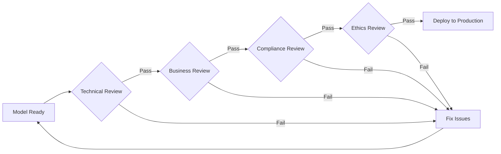
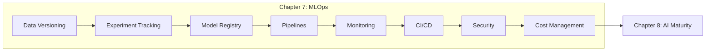

<div align="center">
  

  # Chapter 7: MLOps for Production-Ready AI and Agentic Systems
</div>

---

## Chapter Overview

This chapter bridges the gap between "the model works" and "the model works in production." It covers AgentOps—the systematic practices that transform working prototypes into production-ready systems—addressing the unique challenges of LLM applications: non-deterministic outputs, evolving language patterns, stateful agents, and complex cost structures.

## Learning Objectives

Upon completing this chapter, you will be able to:

- **Understand the AgentOps evolution** - Trace the progression from MLOps (2018-2022) through GenAI Ops (2023) to Agent Ops (2024+)
- **Implement data versioning and lineage** - Track training data, context data, and prompt templates with complete reproducibility
- **Build experiment tracking systems** - Capture relationships between models, prompts, and configurations for agentic systems
- **Configure comprehensive monitoring** - Use Cloud Trace for agent execution visibility and Model Monitoring for drift detection
- **Design CI/CD for AI systems** - Implement Cloud Build and Cloud Deploy pipelines with Binary Authorization
- **Apply security frameworks** - Enforce human controllers, limited powers, and observable actions with Model Armor
- **Manage costs intelligently** - Use FinOps Hub with Gemini Cloud Assist for AI-powered cost optimization

## MLOps Team Organization

Building production AI systems requires clear role boundaries and effective cross-functional collaboration. Without role clarity, teams experience duplicated work, gaps in responsibility, and slow incident resolution.

### Role Clarity Matrix

| Responsibility | ML Engineer | DevOps | SRE | Data Engineer |
|---------------|-------------|--------|-----|---------------|
| Model Training | ✅ Owner | - | - | 🔶 Supports (data quality) |
| Experiment Tracking | ✅ Owner | 🔶 Infrastructure | - | - |
| CI/CD Pipelines | 🔶 Contributes | ✅ Owner | 🔶 Reviews | - |
| Production Monitoring | 🔶 Defines metrics | 🔶 Dashboards | ✅ Owner | - |
| Incident Response | 🔶 Model issues | 🔶 Deployment | ✅ Owner | 🔶 Data issues |
| Cost Optimization | 🔶 Model efficiency | 🔶 Infrastructure | 🔶 Observability | ✅ Owner (storage) |

**Legend**: ✅ Primary owner • 🔶 Contributing role • - Not involved

### Escalation Paths

```
Issue Detected
├─ Model Quality → ML Engineer investigates
├─ Infrastructure → DevOps investigates
├─ Availability → SRE investigates
└─ Data Quality → Data Engineer investigates
   ↓
Severity Assessment
├─ P0 (Production Down) → All teams, immediate escalation
├─ P1 (Degraded) → Daily sync, 24hr target
└─ P2 (Minor) → Weekly review, planned fix
```

### Communication Protocols

**Daily Standup (15 min)**:
- What shipped to production yesterday?
- What's blocking today's work?
- Any production alerts requiring attention?

**Weekly Sync (30 min)**:
- Review P1/P2 incidents
- Discuss cost trends (FinOps Hub dashboard)
- Plan upcoming deployments

**Monthly Retrospective (60 min)**:
- Model performance review
- MLOps metrics (deployment frequency, MTTR, change failure rate)
- Process improvement proposals

## Key Concepts

### The Nine Pillars of AgentOps

```
┌─────────────────────────────────────────────────────────────────────┐
│                        AGENTOPS PILLARS                             │
├─────────────┬─────────────┬─────────────┬─────────────┬────────────┤
│    Data     │   Model     │  Evaluation │   Deploy    │  Observe   │
├─────────────┼─────────────┼─────────────┼─────────────┼────────────┤
│  Security   │   Safety    │    Cost     │  Capacity   │   ...      │
└─────────────┴─────────────┴─────────────┴─────────────┴────────────┘
```

### MLOps Evolution

| Era | Primary Focus | Operational Question |
|-----|---------------|---------------------|
| **MLOps** (2018-2022) | Predictive models | Is the model's accuracy degrading? |
| **GenAI Ops** (2023) | Generative models | Is the output safe, relevant, and cost-effective? |
| **Agent Ops** (2024+) | Autonomous systems | Did the agent complete its task efficiently and safely? |

## Decision Frameworks for Production

Production MLOps requires making systematic decisions about retraining, cost attribution, safety guardrails, and model approval. These frameworks eliminate operational paralysis by providing clear decision trees.

### 1. Retraining Trigger Decision Framework

**When to retrain your model?**

```
Performance degradation detected?
├─ Accuracy dropped >5%? → RETRAIN
├─ F1 declining but >threshold? → MONITOR
└─ Feature drift detected? → INVESTIGATE

New data patterns emerging?
├─ Business domain shift? → RETRAIN
└─ Seasonal patterns? → SCHEDULED RETRAIN

Cost-benefit analysis
├─ Retrain cost < degradation impact? → RETRAIN
└─ Minimal KPI impact? → DEFER
```

**Key Metrics to Track:**
- **Model drift**: PSI (Population Stability Index), KL divergence, JS divergence
- **Feature drift**: Distribution shifts in input features
- **Concept drift**: Changes in relationships between features and target
- **Prediction quality**: Accuracy, precision, recall over rolling windows

**Example from Vertex AI Model Monitoring**: Set drift threshold at 0.15 (15% deviation from baseline) → Trigger alert → ML Engineer reviews → Decide retrain vs tune vs accept.

### 2. Cost Attribution Framework

| Method | Use Case | Granularity | Implementation |
|--------|----------|-------------|----------------|
| **Per-request tagging** | Multi-tenant SaaS | Request-level | Resource labels on Vertex AI Prediction |
| **Team-based** | Internal platform | Team/project | BigQuery + FinOps Hub dashboards |
| **Usage-based chargeback** | Shared ML platform | Department | Cloud Billing export + custom attribution |
| **Agent-level tracking** | Agentic systems | Per-agent | Cloud Trace + custom metrics |

**Decision Tree:**

```
Need cost attribution?
├─ Multi-tenant product? → Per-request tagging
├─ Internal teams sharing platform? → Team-based (project labels)
└─ Executive-level reporting? → Usage-based chargeback
```

**Vertex AI Implementation**: Use resource labels for predictions, experiments, and endpoints. Query with BigQuery billing export.

### 3. Circuit Breaker Configuration

**When to implement protective circuit breakers:**

| Protection Type | Threshold | Action | Vertex AI Tool |
|-----------------|-----------|--------|----------------|
| **Latency** | >30s for LLM, >5s for traditional ML | Timeout, fallback to cached response | Vertex AI Prediction timeout config |
| **Cost** | Daily budget cap (e.g., $1000/day experiments) | Halt new experiments, alert owner | Budget alerts + Cloud Functions |
| **Quality** | Confidence score <0.7 | Reject prediction, request human review | Custom prediction filter |
| **Safety** | High-risk decision detected | Human-in-the-loop approval | Model Armor policies |

**Example Circuit Breaker Pattern:**

```python
# In Vertex AI custom prediction container
if prediction_confidence < 0.7:
    return {"status": "needs_review", "escalate": True}
if latency > 30:
    return cached_fallback_response
```

### 4. Model Lifecycle Approval Workflow

Every model promotion from staging to production requires multi-stakeholder approval:

| Stage | Approvers | Criteria | Tools |
|-------|-----------|----------|-------|
| **Technical** | ML Engineer, SRE | Latency SLAs met, cost within budget, integration tested | Vertex AI Model Monitoring, load tests |
| **Business** | Product Manager | Serves business purpose, brand-safe outputs | A/B test results, business metrics |
| **Compliance** | Legal, Security | HIPAA/GDPR compliance, PII handling, audit logs | Model Cards, Cloud DLP, Access Transparency |
| **Ethical** | Ethics Review Board | Bias assessment passed, fairness validated | Vertex AI Explainable AI, fairness metrics |

**Approval Gates Example:**



**Risk-Based Variation**: Low-risk models (e.g., content recommendations) may skip ethics review. High-risk models (e.g., loan approvals, medical diagnosis) require all four stages.

## AgentOps Maturity Progression

Organizations progress through three maturity stages in their MLOps practices. This section maps the journey from ad hoc experimentation to transformational automation.

### Maturity Stages

| Practice | Ad Hoc (Tactical) | Systematic (Strategic) | Transformational |
|----------|-------------------|------------------------|------------------|
| **Data Versioning** | Git commits, manual tags | DVC/Vertex ML Metadata | Self-documenting pipelines with lineage |
| **Experiment Tracking** | Spreadsheets, notebooks | Vertex Experiments SDK | AutoML hyperparameter optimization |
| **Model Monitoring** | Manual checks, ad hoc queries | Automated drift detection | Predictive drift, auto-retrain triggers |
| **Deployment** | Manual scripts, SSH to servers | CI/CD with Cloud Build | Continuous deployment + instant rollback |
| **Cost Management** | Monthly billing review | Resource tagging, FinOps dashboards | FinOps agents with forecasting |
| **Security** | Reactive patching | Binary Authorization, VPC-SC | Model Armor, automated compliance |

### Progression Timeline

**Weeks 1-4: Foundation**
- Implement data versioning (Vertex ML Metadata)
- Set up experiment tracking (Vertex Experiments)
- Establish baseline metrics

**Weeks 5-8: Automation**
- Deploy model registry (Vertex AI Model Registry)
- Configure basic monitoring (Model Monitoring)
- Implement alerting (Cloud Monitoring)

**Weeks 9-12: CI/CD**
- Build CI/CD pipelines (Cloud Build + Cloud Deploy)
- Add security guardrails (Binary Authorization)
- Enable automated testing

**Months 4-6: Advanced Capabilities**
- Sophisticated monitoring (drift detection, explainability)
- Cost attribution framework
- A/B deployment strategies

**Months 7-12: Transformation**
- Full automation (AIOps)
- Self-optimizing systems
- Multi-agent orchestration (Chapter 4)

### Progression Indicators

**You're Ready for Strategic Phase When:**
- ✅ 100% of experiments tracked in Vertex Experiments
- ✅ All production models in Model Registry with versions
- ✅ Automated CI/CD for model deployment
- ✅ Monitoring dashboards reviewed weekly

**You're Ready for Transformational Phase When:**
- ✅ Drift detection triggers automatic retraining
- ✅ Cost forecasting predicts budget needs
- ✅ Security policies enforced automatically
- ✅ Multi-agent systems in production (Chapter 4)

See **Chapter 8** for the full AI Maturity Framework assessment across Vision, Talent, and Operational dimensions.

## Learning Resources

### Recommended Courses

| Course | Platform | Description |
|--------|----------|-------------|
| [5-Day Gen AI Intensive Course](https://www.kaggle.com/learn-guide/5-day-genai) | Kaggle | Day 5: MLOps for Generative AI, Agent Starter Pack walkthrough |
| [5-Day AI Agents Intensive Course](https://www.kaggle.com/learn-guide/5-day-agents) | Kaggle | Day 5: Prototype to Production with A2A protocol |

### Video Tutorials

| Video | Topic |
|-------|-------|
| [Agentic Security Fundamentals](https://youtu.be/jZXvqEqJT7o) | OWASP Top 10 for LLMs, Model Armor, agent identity |
| [Operationalize AI Agents](https://youtu.be/kJRgj58ujEk) | End-to-end architecture for building, deploying, evaluating agents |

---

## Production AgentOps Patterns

Real-world production systems face unique challenges: catastrophic model shifts, feedback loop amplification, and reduced output diversity. These patterns help detect and mitigate production issues before they impact users.

### 1. Detecting Semantic Drift in LLM Outputs

**Pattern**: LLM outputs gradually shift away from expected style, tone, or accuracy.

**Detection Strategy:**

```python
# Track embedding drift using reference set
from vertexai.evaluation import EmbeddingDriftDetector

# Establish baseline from validation set
reference_embeddings = model.embed(test_queries)

# Monitor production queries
current_embeddings = model.embed(production_queries)

drift_score = calculate_embedding_drift(reference_embeddings, current_embeddings)
if drift_score > 0.15:  # 15% threshold
    alert("SEMANTIC DRIFT DETECTED - Review outputs")
```

**Monitoring Configuration:**
- **Baseline**: Establish embedding space from validation set (1000+ examples)
- **Detection Window**: Rolling 7-day window
- **Alert Threshold**: >15% drift in embedding centroid position
- **Action**: Trigger human review of outputs, investigate training data changes

**Vertex AI Implementation**: Use Text Embedding API to compute embeddings, store in BigQuery, calculate drift with SQL window functions.

### 2. Model Collapse Detection

**Pattern**: Generative models produce increasingly repetitive, less diverse outputs over time.

**Symptoms:**
- Repetitive phrases across different prompts
- Reduced creativity and variety
- Homogenization of outputs

**Detection Metrics:**

```python
# Track unique n-grams in responses
def calculate_diversity(responses):
    unique_trigrams = set()
    total_trigrams = 0

    for response in responses:
        trigrams = extract_trigrams(response)
        unique_trigrams.update(trigrams)
        total_trigrams += len(trigrams)

    diversity_score = len(unique_trigrams) / total_trigrams
    return diversity_score

# Alert if diversity drops
baseline_diversity = 0.75  # 75% unique trigrams
current_diversity = calculate_diversity(production_responses)

if current_diversity < 0.50:  # <50% threshold
    alert("MODEL COLLAPSE RISK - Diversity dropped to {current_diversity}")
```

**Mitigation Actions:**
- Revert to previous checkpoint
- Investigate fine-tuning data for repetitive patterns
- Increase temperature parameter temporarily
- Review training data diversity

### 3. Ablation Studies in Production

**Pattern**: Systematically disable features to measure impact and identify unnecessary complexity.

**Example: RAG System Feature Analysis**

```
Baseline (all features): 85% F1 Score
├─ Remove reranking: 81% (-4%) → CRITICAL FEATURE, keep
├─ Remove query expansion: 84% (-1%) → MARGINAL, evaluate cost/benefit
├─ Remove hybrid search: 85% (0%) → NO IMPACT, remove to reduce cost
└─ Remove context compression: 78% (-7%) → CRITICAL FEATURE, keep
```

**When to Run Ablation Studies:**
- After adding new features to RAG pipelines
- When optimizing inference costs
- During performance troubleshooting
- Before major architectural changes

**Vertex AI Implementation**: Use Vertex AI Experiments to track ablation runs. Run A/B tests with feature flags in Vertex AI Prediction.

### 4. Feedback Loop Amplification Prevention

**Pattern**: Systems retrained on user-selected outputs gradually drift toward extreme behaviors.

**Real-World Example:**
- Customer service agent trained on highly-rated interactions
- Model becomes increasingly verbose and apologetic
- Response length grows from 50 words → 200 words over 6 months

**Detection:**

```python
# Track response characteristics over time
metrics = {
    "avg_response_length": [],
    "sentiment_score": [],
    "keyword_frequency": {}
}

# Alert on drift
if avg_response_length > baseline * 1.5:
    alert("RESPONSE LENGTH INFLATION - Feedback loop detected")
```

**Mitigation Strategies:**
- **Balance training data**: Mix user feedback with objective quality metrics
- **Set invariant constraints**: Enforce response length limits, tone guidelines
- **Periodic baseline resets**: Retrain from original dataset every N iterations
- **Human-in-the-loop validation**: Review training data selections

### 5. Catastrophic Model Shifts

**Pattern**: Sudden, dramatic changes in model behavior after deployment or retraining.

**Warning Signs:**
- Sudden spike in error rates (>3x normal)
- Dramatic change in output distribution
- User complaints increase significantly

**Phase Transition Detection:**

```python
# Monitor key metrics for sudden jumps
from scipy.stats import ks_test

# Compare current week vs previous week output distributions
current_week_outputs = get_outputs(days=7)
previous_week_outputs = get_outputs(days=7, offset=7)

statistic, p_value = ks_test(current_week_outputs, previous_week_outputs)

if p_value < 0.01:  # Statistically significant shift
    alert("CATASTROPHIC SHIFT DETECTED - Outputs diverged from baseline")
    trigger_rollback()
```

**Rollback Procedure:**
1. Immediately revert to previous model version (Model Registry)
2. Analyze what changed (training data, hyperparameters, dependencies)
3. Test fix in staging environment
4. Gradual rollout with traffic splitting

**Vertex AI Implementation**: Use Model Registry versioning for instant rollback. Configure traffic splitting in Vertex AI Endpoints (10% → 50% → 100%).

### 6. Multi-Agent Coordination Monitoring

**Pattern**: In multi-agent systems (Chapter 4), agents may enter infinite loops or resource contention.

**Monitoring Metrics:**
- Agent-to-agent call depth (detect loops)
- Resource utilization per agent
- Task completion rates
- Inter-agent handoff success rates

**Circuit Breaker for Agents:**

```python
# In Agent Development Kit (ADK)
MAX_AGENT_DEPTH = 5
MAX_EXECUTION_TIME = 300  # 5 minutes

if current_call_depth > MAX_AGENT_DEPTH:
    raise AgentLoopDetected("Agent call depth exceeded")

if execution_time > MAX_EXECUTION_TIME:
    raise AgentTimeoutError("Agent execution timed out")
```

**Cloud Trace Integration**: Use Cloud Trace to visualize agent execution paths and identify bottlenecks.

---

## Hands-On Notebooks

Explore official Google Cloud notebooks aligned with Chapter 7 topics.

### Data Versioning & ML Metadata

| Notebook | Chapter Concepts | Description |
|----------|------------------|-------------|
| [vertex-pipelines-ml-metadata.ipynb](https://github.com/GoogleCloudPlatform/vertex-ai-samples/blob/main/notebooks/official/ml_metadata/vertex-pipelines-ml-metadata.ipynb) | **Data versioning pillar** (reproducibility, lineage graphs, artifact tracking) | Tracking artifacts and metrics with Vertex ML Metadata, lineage tracing |
| [sdk-metric-parameter-tracking-for-custom-jobs.ipynb](https://github.com/GoogleCloudPlatform/vertex-ai-samples/blob/main/notebooks/official/ml_metadata/sdk-metric-parameter-tracking-for-custom-jobs.ipynb) | **Experiment tracking** (parameter logging, custom training jobs) | Tracking training parameters and prediction metrics |
| [sdk-metric-parameter-tracking-for-locally-trained-models.ipynb](https://github.com/GoogleCloudPlatform/vertex-ai-samples/blob/main/notebooks/official/ml_metadata/sdk-metric-parameter-tracking-for-locally-trained-models.ipynb) | **Local-to-cloud tracking** (hybrid workflows, metadata consistency) | Tracking for locally trained models |

### Experiment Tracking

| Notebook | Chapter Concepts | Description |
|----------|------------------|-------------|
| [get_started_with_vertex_experiments.ipynb](https://github.com/GoogleCloudPlatform/vertex-ai-samples/blob/main/notebooks/official/experiments/get_started_with_vertex_experiments.ipynb) | **Experiment tracking pillar** (systematic experimentation, comparison framework) | Comprehensive guide to experiment creation and comparison |
| [get_started_with_vertex_experiments_autologging.ipynb](https://github.com/GoogleCloudPlatform/vertex-ai-samples/blob/main/notebooks/official/experiments/get_started_with_vertex_experiments_autologging.ipynb) | **Automation** (framework integration, zero-code tracking) | Autologging with scikit-learn, TensorFlow, PyTorch |
| [comparing_local_trained_models.ipynb](https://github.com/GoogleCloudPlatform/vertex-ai-samples/blob/main/notebooks/official/experiments/comparing_local_trained_models.ipynb) | **Model comparison** (evaluation metrics, performance analysis) | Comparing and evaluating model experiments |
| [comparing_pipeline_runs.ipynb](https://github.com/GoogleCloudPlatform/vertex-ai-samples/blob/main/notebooks/official/experiments/comparing_pipeline_runs.ipynb) | **Pipeline experiments** (workflow versioning, end-to-end tracking) | Logging and comparing different pipeline jobs |
| [build_model_experimentation_lineage_with_prebuild_code.ipynb](https://github.com/GoogleCloudPlatform/vertex-ai-samples/blob/main/notebooks/official/experiments/build_model_experimentation_lineage_with_prebuild_code.ipynb) | **Lineage tracking** (reproducibility, artifact relationships) | Experimentation with lineage tracking |

### Model Registry

| Notebook | Chapter Concepts | Description |
|----------|------------------|-------------|
| [get_started_with_model_registry.ipynb](https://github.com/GoogleCloudPlatform/vertex-ai-samples/blob/main/notebooks/official/model_registry/get_started_with_model_registry.ipynb) | **Model registry pillar** (version control, approval workflow from framework) | Creating and registering model versions |
| [bqml_vertexai_model_registry.ipynb](https://github.com/GoogleCloudPlatform/vertex-ai-samples/blob/main/notebooks/community/model_registry/bqml_vertexai_model_registry.ipynb) | **BigQuery integration** (SQL-trained models, unified registry) | BigQuery ML and Model Registry integration |
| [vertex_ai_model_registry_automl_model_versioning.ipynb](https://github.com/GoogleCloudPlatform/vertex-ai-samples/blob/main/notebooks/community/model_registry/vertex_ai_model_registry_automl_model_versioning.ipynb) | **AutoML versioning** (no-code models, managed lifecycle) | AutoML model versioning |

### Pipelines & Automation

| Notebook | Chapter Concepts | Description |
|----------|------------------|-------------|
| [pipelines_intro_kfp.ipynb](https://github.com/GoogleCloudPlatform/vertex-ai-samples/blob/main/notebooks/official/pipelines/pipelines_intro_kfp.ipynb) | **Automation pillar** (Kubeflow Pipelines, orchestration) | Introduction to Vertex AI Pipelines with KFP |
| [google_cloud_pipeline_components_model_train_upload_deploy.ipynb](https://github.com/GoogleCloudPlatform/vertex-ai-samples/blob/main/notebooks/official/pipelines/google_cloud_pipeline_components_model_train_upload_deploy.ipynb) | **End-to-end MLOps** (train → register → deploy automation) | Complete train-upload-deploy workflow |
| [challenger_vs_blessed_deployment_method.ipynb](https://github.com/GoogleCloudPlatform/vertex-ai-samples/blob/main/notebooks/official/pipelines/challenger_vs_blessed_deployment_method.ipynb) | **A/B deployment** (traffic splitting, gradual rollout) | A/B model deployment strategies |
| [multicontender_vs_champion_deployment_method.ipynb](https://github.com/GoogleCloudPlatform/vertex-ai-samples/blob/main/notebooks/official/pipelines/multicontender_vs_champion_deployment_method.ipynb) | **Multi-model evaluation** (champion-challenger pattern) | Multi-model evaluation for production |
| [control_flow_kfp.ipynb](https://github.com/GoogleCloudPlatform/vertex-ai-samples/blob/main/notebooks/official/pipelines/control_flow_kfp.ipynb) | **Dynamic pipelines** (conditional logic, branching) | Implementing loops and conditionals in pipelines |

### Model Monitoring

| Notebook | Chapter Concepts | Description |
|----------|------------------|-------------|
| [get_started_with_model_monitoring_setup.ipynb](https://github.com/GoogleCloudPlatform/vertex-ai-samples/blob/main/notebooks/official/model_monitoring/get_started_with_model_monitoring_setup.ipynb) | **Monitoring pillar** (drift detection from retraining framework) | Foundational monitoring setup guide |
| [model_monitoring.ipynb](https://github.com/GoogleCloudPlatform/vertex-ai-samples/blob/main/notebooks/official/model_monitoring/model_monitoring.ipynb) | **Drift detection** (PSI, KL divergence from framework, anomaly detection) | Detecting drift and anomalies with Explainable AI |
| [batch_prediction_model_monitoring.ipynb](https://github.com/GoogleCloudPlatform/vertex-ai-samples/blob/main/notebooks/official/model_monitoring/batch_prediction_model_monitoring.ipynb) | **Batch monitoring** (offline predictions, scheduled checks) | Monitoring batch predictions |
| [get_started_with_model_monitoring_custom.ipynb](https://github.com/GoogleCloudPlatform/vertex-ai-samples/blob/main/notebooks/official/model_monitoring/get_started_with_model_monitoring_custom.ipynb) | **Custom metrics** (domain-specific monitoring) | Monitoring custom tabular models |
| [get_started_with_model_monitoring_xgboost.ipynb](https://github.com/GoogleCloudPlatform/vertex-ai-samples/blob/main/notebooks/official/model_monitoring/get_started_with_model_monitoring_xgboost.ipynb) | **XGBoost monitoring** (tree-based model drift) | XGBoost drift detection |

### Feature Store

| Notebook | Chapter Concepts | Description |
|----------|------------------|-------------|
| [vertex_ai_feature_store_based_llm_grounding_tutorial.ipynb](https://github.com/GoogleCloudPlatform/vertex-ai-samples/blob/main/notebooks/official/feature_store/vertex_ai_feature_store_based_llm_grounding_tutorial.ipynb) | **LLM grounding** (RAG with Feature Store, real-time context) | LLM grounding with Feature Store |
| [online_feature_serving_and_fetching_bigquery_data_with_feature_store_optimized.ipynb](https://github.com/GoogleCloudPlatform/vertex-ai-samples/blob/main/notebooks/official/feature_store/online_feature_serving_and_fetching_bigquery_data_with_feature_store_optimized.ipynb) | **Online serving** (low-latency features, BigQuery integration) | Online feature serving |
| [feature_monitoring_with_feature_registry.ipynb](https://github.com/GoogleCloudPlatform/vertex-ai-samples/blob/main/notebooks/official/feature_store/feature_monitoring_with_feature_registry.ipynb) | **Feature drift** (feature monitoring from retraining framework) | Feature monitoring with registry |

### Model Deployment

| Notebook | Chapter Concepts | Description |
|----------|------------------|-------------|
| [get_started_with_dedicated_endpoint.ipynb](https://github.com/GoogleCloudPlatform/vertex-ai-samples/blob/main/notebooks/official/prediction/get_started_with_dedicated_endpoint.ipynb) | **Deployment pillar** (production serving, SLA guarantees) | Using dedicated endpoints |
| [get_started_with_vertex_private_endpoints.ipynb](https://github.com/GoogleCloudPlatform/vertex-ai-samples/blob/main/notebooks/official/prediction/get_started_with_vertex_private_endpoints.ipynb) | **Security** (VPC-SC, private networking from security pillar) | Private endpoints configuration |
| [llm_streaming_prediction.ipynb](https://github.com/GoogleCloudPlatform/vertex-ai-samples/blob/main/notebooks/official/prediction/llm_streaming_prediction.ipynb) | **LLM deployment** (streaming responses, latency optimization) | LLM streaming and batch predictions |
| [SDK_Custom_Container_Prediction.ipynb](https://github.com/GoogleCloudPlatform/vertex-ai-samples/blob/main/notebooks/official/custom/SDK_Custom_Container_Prediction.ipynb) | **Custom serving** (FastAPI, custom logic, circuit breakers from framework) | Custom container serving with FastAPI |

### Explainable AI

| Notebook | Chapter Concepts | Description |
|----------|------------------|-------------|
| [xai_image_classification_feature_attributions.ipynb](https://github.com/GoogleCloudPlatform/vertex-ai-samples/blob/main/notebooks/official/explainable_ai/xai_image_classification_feature_attributions.ipynb) | **Model interpretability** (feature attributions, ethical review from approval framework) | Feature-based explanations for images |
| [xai_text_classification_feature_attributions.ipynb](https://github.com/GoogleCloudPlatform/vertex-ai-samples/blob/main/notebooks/official/explainable_ai/xai_text_classification_feature_attributions.ipynb) | **Shapley values** (SHAP for NLP, bias detection) | Shapley method for text models |
| [sdk_custom_tabular_regression_online_explain.ipynb](https://github.com/GoogleCloudPlatform/vertex-ai-samples/blob/main/notebooks/official/explainable_ai/sdk_custom_tabular_regression_online_explain.ipynb) | **Online explanations** (real-time interpretability, production XAI) | Online prediction with explanations |

### GenAI/LLM Operations

| Notebook | Chapter Concepts | Description |
|----------|------------------|-------------|
| [backoff_and_retry_for_LLMs.ipynb](https://github.com/GoogleCloudPlatform/vertex-ai-samples/blob/main/notebooks/community/generative_ai/backoff_and_retry_for_LLMs.ipynb) | **GenAI Ops** (resilience, circuit breakers from framework, rate limiting) | Resilience patterns for LLM operations |
| [text_embedding_api_cloud_next_new_models.ipynb](https://github.com/GoogleCloudPlatform/vertex-ai-samples/blob/main/notebooks/community/generative_ai/text_embedding_api_cloud_next_new_models.ipynb) | **Semantic drift** (embeddings for drift detection from production patterns) | Text embeddings and foundation models |

### Agent Operations

| Notebook | Chapter Concepts | Description |
|----------|------------------|-------------|
| [adk_inline_source_deployment.ipynb](https://github.com/GoogleCloudPlatform/vertex-ai-samples/blob/main/notebooks/community/agent_engine/adk_inline_source_deployment.ipynb) | **Agent Ops** (ADK deployment, multi-agent monitoring from production patterns) | ADK inline source deployment |

> **Browse all notebooks**: [Official](https://github.com/GoogleCloudPlatform/vertex-ai-samples/tree/main/notebooks/official) | [Community](https://github.com/GoogleCloudPlatform/vertex-ai-samples/tree/main/notebooks/community)

---

## Chapter Roadmap



## What's Next

In **Chapter 8**, you'll explore the AI and Agentic Maturity Framework—helping you assess where your organization stands across multiple dimensions and plan your journey from tactical AI adoption to transformational integration.

---

[← Previous Chapter](../chapter-6/) | [Home](../) | [Next Chapter →](../chapter-8/)
