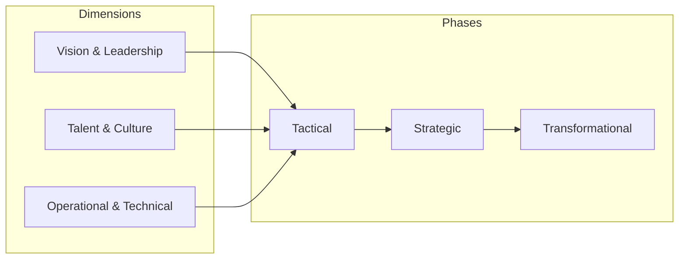
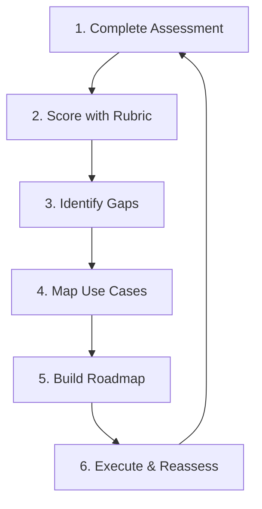

# Chapter 8: The AI and Agentic Maturity Framework

This chapter provides a comprehensive framework for assessing and advancing your organization's AI capabilities. Moving beyond technical implementation, it focuses on the strategic, cultural, and operational dimensions that determine whether AI initiatives deliver sustained business value.

## Overview

The AI and Agentic Maturity Framework evaluates organizational readiness across three dimensions and three phases:



| Dimension | Focus | Key Questions |
|-----------|-------|---------------|
| **Vision & Leadership** | The "What" and "Why" | Is AI funding multiyear? Can the CEO articulate AI's role? |
| **Talent & Culture** | The "Who" | Is AI literacy universal? Are failed experiments celebrated? |
| **Operational & Technical** | The "How" | Is MLOps automated? Are security guardrails embedded? |

---

## Assessment Tools

This chapter provides practical templates for organizational AI maturity assessment:

| Asset | Purpose | Use Case |
|-------|---------|----------|
| [maturity_assessment.md](./maturity_assessment.md) | Self-assessment workbook | Score your organization across 28+ questions |
| [maturity_rubric.md](./maturity_rubric.md) | Detailed phase descriptions | Understand what each maturity level looks like |
| [use_case_mapping.md](./use_case_mapping.md) | Prioritization template | Map AI use cases by value vs. effort |
| [roadmap_template.md](./roadmap_template.md) | Transition planning | Plan your journey between phases |
| [resources.md](./resources.md) | Learning paths | Certifications, frameworks, further reading |

---

## Quick Start: How to Use These Tools



### Step 1: Complete the Self-Assessment

1. Gather stakeholders from leadership, HR, and technical teams
2. Complete [maturity_assessment.md](./maturity_assessment.md) independently
3. Aggregate scores by dimension
4. Discuss areas of disagreement

### Step 2: Interpret Your Scores

Use [maturity_rubric.md](./maturity_rubric.md) to understand:
- **Tactical (Score 1-2)**: Ad hoc, siloed, reactive
- **Strategic (Score 3-4)**: Centralized, standardized, proactive
- **Transformational (Score 5)**: Embedded, automated, self-optimizing

### Step 3: Prioritize Use Cases

Use [use_case_mapping.md](./use_case_mapping.md) to identify:
- **Quick Wins**: High value, easy to execute
- **Strategic Bets**: High value, requires investment
- **Fill-ins**: Low value, easy (do if resources allow)
- **Avoid**: Low value, hard (deprioritize)

### Step 4: Build Your Roadmap

Use [roadmap_template.md](./roadmap_template.md) to plan:
- Phase transition milestones
- Resource allocation (people, process, technology)
- Success criteria by dimension

---

## Phase Transition Playbooks

Moving between maturity phases requires systematic transformation across all three dimensions. These playbooks provide actionable 90-day and 12-month roadmaps.

### Tactical → Strategic Transformation (90 Days)

**Objective**: Establish foundational governance, centralized platform, and executive sponsorship.

#### Month 1: Foundation Assessment

**Week 1-2: Maturity Assessment Workshop**
- Gather cross-functional team (leadership, technical, HR)
- Complete [maturity_assessment.md](./maturity_assessment.md) independently
- Aggregate scores by dimension
- Identify top 5 blockers to Strategic phase

**Week 3: Gap Analysis**
- **Vision Gap**: Lack of executive sponsorship? → Prepare business case
- **Talent Gap**: Siloed expertise? → Plan upskilling program
- **Operational Gap**: Manual processes? → Inventory MLOps debt

**Week 4: Secure Executive Buy-In**
- Present maturity assessment results to C-suite
- Demonstrate cost of inaction (e.g., pilot purgatory, security risks)
- Secure multiyear AI budget commitment (Strategic phase requirement)
- Appoint executive AI sponsor

**Deliverables**:
- ✅ Maturity assessment completed
- ✅ Executive sponsor assigned
- ✅ Budget secured ($500K-$2M typical for Strategic transition)

#### Month 2: Quick Wins + Platform Setup

**Week 5-6: Implement Data Governance** (Chapter 2)
- Deploy Dataplex for data discovery
- Configure BigQuery for unified analytics layer
- Enable Cloud DLP for PII detection
- Establish data quality SLOs

**Week 7-8: Deploy Evaluation Framework** (Chapter 5)
- Install Vertex AI Gen AI Evaluation SDK
- Define human eval rubrics for 3 key use cases
- Build automated metrics pipeline
- Run baseline evaluations on existing models

**Why These Quick Wins?**
- Data governance unblocks Operational dimension
- Evaluation framework demonstrates quality rigor (Vision dimension)
- Visible progress maintains momentum

**Deliverables**:
- ✅ Data catalog operational
- ✅ Evaluation metrics tracked
- ✅ First 3 AI projects assessed

#### Month 3: MLOps Foundation

**Week 9-10: Centralized MLOps Platform** (Chapter 7)
- Deploy Vertex AI Pipelines for automation
- Configure Model Registry for versioning
- Set up Cloud Build for CI/CD
- Enable Vertex AI Model Monitoring

**Week 11-12: First Strategic Project**
- Apply all frameworks from Months 1-2
- Deploy with MLOps automation
- Measure business impact (revenue, efficiency, risk reduction)
- Document lessons learned

**Success Metrics for 90 Days**:
- ✅ **Maturity Score**: 1.5 → 3.0 average across dimensions
- ✅ **Projects**: 3+ AI projects in production with MLOps
- ✅ **Governance**: Data governance policies enforced
- ✅ **Budget**: Dedicated AI budget allocated
- ✅ **Culture**: First AI literacy training completed

---

### Strategic → Transformational (12 Months)

**Objective**: Embed AI in business model, enable self-service, deploy AIOps.

#### Q1: Cultural Transformation

**Months 1-3:**

**Vision & Leadership**:
- AI fluency becomes hiring requirement for VP+ roles
- CEO begins public AI advocacy (blog posts, conference talks)
- Quarterly board-level AI performance reviews

**Talent & Culture**:
- Organization-wide AI literacy program (Gemini for Workspace rollout)
- Innovation challenge: $50K prize for employee-driven AI proposals
- "Safe-to-fail" culture: Celebrate fast failures in AI experiments

**Operational & Technical**:
- Platform consolidation: Migrate all AI workloads to Vertex AI
- Cost attribution framework deployed (Chapter 7)
- Security audits: Binary Authorization, Model Armor enabled

**Q1 Deliverables**:
- ✅ 80% of employees completed AI literacy training
- ✅ 5+ employee-driven AI pilots launched
- ✅ All AI costs attributed to business units

#### Q2: Platform Democratization

**Months 4-6:**

**Deploy Gemini Enterprise Hub**:
- Enable all employees to access Gemini for Workspace
- Launch no-code agent creation (Agent Builder)
- Implement self-service RAG (Chapter 2 GraphRAG)

**Advanced MLOps**:
- Automated retraining triggers (drift detection → retrain)
- Multi-model A/B testing at scale
- FinOps agents for predictive cost management

**Data Excellence**:
- Semantic layer fully operational (Chapter 2)
- Real-time data pipelines (streaming RAG)
- Data mesh architecture for domain ownership

**Q2 Deliverables**:
- ✅ 100+ agents created by non-technical employees
- ✅ Automated retraining for 10+ production models
- ✅ Cost forecasting accuracy >90%

#### Q3: Advanced Capabilities

**Months 7-9:**

**Multi-Agent Systems** (Chapter 4):
- Deploy A2A (Agent-to-Agent) protocol
- Multi-agent orchestration in production
- Agent observability with Cloud Trace

**AIOps - Self-Optimizing Pipelines** (Chapter 7):
- Auto-tuning hyperparameters
- Predictive resource scaling
- Intelligent alert routing

**Fine-Tuning Infrastructure** (Chapter 6):
- GKE-based fine-tuning clusters
- LoRA/QLoRA at scale
- Model merging experiments

**Q3 Deliverables**:
- ✅ 3+ multi-agent systems in production
- ✅ Pipelines self-optimize without manual intervention
- ✅ Custom fine-tuned models outperform base models

#### Q4: Market Leadership

**Months 10-12:**

**External Recognition**:
- CEO keynotes at AI conferences
- Publish innovation case studies (blog posts, whitepapers)
- Contribute to open-source (ADK agent library)

**AI-Native Business Model**:
- AI drives product roadmap decisions
- AI-generated insights in board materials
- Competitive advantage measured by AI maturity

**Continuous Innovation**:
- Quarterly hackathons for AI innovation
- Partnerships with AI research institutions
- Dedicated AI R&D budget (5-10% of AI spend)

**12-Month Success Metrics**:
- ✅ **Maturity Score**: 4.0 → 5.0 (Transformational)
- ✅ **AI-Native**: AI embedded in core business processes
- ✅ **Self-Service**: 500+ employee-created agents
- ✅ **AIOps**: 90% of pipelines self-optimizing
- ✅ **Business Impact**: AI contributes 10%+ to revenue or cost savings

---

## The Three Phases

### Tactical Phase

Organizations at this phase are characterized by:

- **Vision**: Ad hoc AI pilots without central coordination
- **Talent**: Siloed expertise, limited AI literacy programs
- **Operations**: Manual processes, fragmented tooling, reactive security

**Key Challenge**: "Pilot purgatory" - successful experiments fail to scale.

### Strategic Phase

Organizations at this phase demonstrate:

- **Vision**: Dedicated multiyear budget, executive sponsorship, responsible AI principles
- **Talent**: Structured upskilling programs, safe-to-fail culture, defined career paths
- **Operations**: Centralized MLOps platform, automated CI/CD, proactive monitoring

**Key Achievement**: Repeatable, scalable AI capabilities with governance.

### Transformational Phase

Organizations at this phase exhibit:

- **Vision**: AI embedded in business model, CEO as visible champion
- **Talent**: AI fluency as core competency, human-AI collaboration as default
- **Operations**: AIOps (self-optimizing pipelines), A2A/A2H protocols, FinOps agents

**Key Outcome**: AI drives sustained competitive advantage and shapes industry standards.

---

## Dimension Interdependencies

AI maturity dimensions don't advance independently—they form a reinforcing system. Optimizing one dimension in isolation creates imbalance and failure modes.

### How Dimensions Interact

```
Vision & Leadership (Funds & Directs)
         ↓
Talent & Culture (Builds & Innovates)
         ↓
Operational & Technical (Demonstrates Value)
         ↓
Vision & Leadership (Reinforced by Results)
```

**Critical Insight**: You can't optimize one dimension in isolation.

### Common Failure Modes

#### ❌ Strong Vision, Weak Talent

**Scenario**: CEO mandates "AI transformation" but organization lacks skills.

**Symptoms**:
- Consultants hired to "do AI" instead of internal capability building
- Pilots succeed, then stall when consultants leave
- Technical debt accumulates

**Example**: Cymbal Health (Tactical phase) had executive enthusiasm but siloed data scientists without MLOps expertise.

**Fix**: Invest in Talent dimension first—upskilling before mandates.

---

#### ❌ Strong Operations, Weak Vision

**Scenario**: Excellent MLOps infrastructure but no business alignment.

**Symptoms**:
- Sophisticated platforms sit unused
- Engineers optimize for technical elegance over business value
- "Pilot purgatory"—many experiments, no production deployments

**Example**: A retail company built world-class Vertex AI pipelines but lacked executive sponsorship. Projects were deprioritized during budget cuts.

**Fix**: Secure Vision dimension—executive sponsorship and budget.

---

#### ❌ Strong Talent, Weak Operations

**Scenario**: Brilliant data scientists without production tooling.

**Symptoms**:
- Models trained on laptops, never deployed
- Manual deployments that break in production
- No reproducibility or lineage tracking

**Example**: Startups often have strong ML talent but skip MLOps "because we're moving fast."

**Fix**: Invest in Operational dimension—at minimum: version control, experiment tracking, CI/CD.

---

### Dependency Sequencing Strategy

**Vision MUST mature first** → Enables Talent investment → Enables Operational efficiency

**Recommended Advancement Order**:

1. **Vision & Leadership** (Weeks 1-4)
   - Secure executive sponsor
   - Allocate multiyear budget
   - Define responsible AI principles

2. **Talent & Culture** (Weeks 5-12, parallel with Operational)
   - Launch upskilling programs
   - Hire key roles (ML Engineer, Data Engineer, MLOps)
   - Establish safe-to-fail culture

3. **Operational & Technical** (Weeks 5-12, parallel with Talent)
   - Deploy centralized platform (Vertex AI)
   - Implement data governance (Chapter 2)
   - Build MLOps foundation (Chapter 7)

4. **Demonstrate Value** (Month 3)
   - Deploy first production AI system
   - Measure business impact
   - Showcase to leadership

5. **Iterate** (Quarterly)
   - Reassess maturity across all three dimensions
   - Address lagging dimension
   - Advance to next phase when all dimensions ≥3.0

---

### Balancing Strategy

**Assess Quarterly**: Use [maturity_assessment.md](./maturity_assessment.md) every 90 days.

**Address Weakest Dimension First**:
- Vision: 2.0, Talent: 3.5, Operational: 4.0 → Focus on Vision
- All dimensions 3.0+ → Ready for Strategic phase
- Any dimension <2.0 → Stuck in Tactical phase

**Invest Proportionally**:
- **Vision**: 20% (executive time, strategy consulting)
- **Talent**: 40% (hiring, training, culture programs)
- **Operational**: 40% (platform, infrastructure, tooling)

---

## Data Readiness Foundation

A strong data strategy is foundational to AI maturity. The concepts from Chapter 2 directly enable progression:

| Phase | Data Capability |
|-------|-----------------|
| **Tactical** | Struggle with data discoverability and quality |
| **Strategic** | Robust governance, semantic layer, trustworthy data foundation |
| **Transformational** | Fully integrated, agile, seamless data accessibility |

> "The journey through the AI and agentic maturity framework is, in practice, the journey of mastering your data strategy."

---

## Platform Approaches

Two key platform categories accelerate maturity:

### Vertex AI Platform

The technical engine for AI production:
- **Governance**: Model Registry, ML Metadata, Explainable AI
- **Integration**: Native BigQuery, Extensions (function calling), RAG
- **Velocity**: Automated pipelines, managed serving, AIOps capability

### Gemini Enterprise

The agentic platform for every user:
- **Prebuilt Agents**: Deep Research, Idea Generation, Data Insights
- **No-Code Agents**: Natural language-based agent creation
- **Enterprise Hub**: Unified access to all AI assets and knowledge

---

## Technology Decision Frameworks

Advancing AI maturity requires strategic technology decisions: build vs buy, organizational structure, and platform selection. These frameworks eliminate decision paralysis.

### Build vs Buy Decision Framework

```
Need AI capability?
├─ Core competitive differentiator?
│  └─ Yes → BUILD (custom model/system)
├─ Unique data/domain advantage?
│  └─ Yes → BUILD (fine-tune or build)
├─ Mature vendor solution exists?
│  └─ Yes → BUY (managed service)
├─ Timeline?
│  ├─ <3 months → BUY
│  └─ >6 months → BUILD (if justified)
└─ Team expertise?
   ├─ Strong AI team → BUILD
   └─ Limited team → BUY
```

**Decision Matrix**:

| Capability | Decision | Rationale | Implementation |
|------------|----------|-----------|----------------|
| **Customer support chatbot** | BUY | Commodity capability, fast deployment | Vertex AI Agent Engine |
| **Fraud detection (unique patterns)** | BUILD | Proprietary data = competitive advantage | Custom model on Vertex AI |
| **Document summarization** | BUY | Mature LLM capability | Gemini API |
| **Domain code generation** | HYBRID | Specific needs + base capabilities | Fine-tune Gemini on Vertex AI |
| **Medical diagnosis** | BUILD | Regulatory requirements, liability | Custom model with explainability |

**Build Decision Criteria**:
- ✅ Unique competitive advantage from custom approach
- ✅ Proprietary data not accessible to vendors
- ✅ Regulatory/compliance requires full control
- ✅ Strong internal AI team (5+ ML Engineers)
- ✅ Budget for ongoing maintenance (2-3x initial development)

**Buy Decision Criteria**:
- ✅ Non-differentiated capability (e.g., transcription, translation)
- ✅ Fast time-to-market critical (<3 months)
- ✅ Limited AI expertise in-house
- ✅ Vendor solution meets 80%+ requirements
- ✅ Cost of managed service < cost of internal development

---

### Organizational Structure Decision

**Centralized vs Distributed AI Teams**:

| Model | Best For | Pros | Cons |
|-------|----------|------|------|
| **Centralized CoE** (Center of Excellence) | Strategic phase | Standardization, platform efficiency, knowledge sharing | Bottleneck risk, slower domain innovation |
| **Distributed (Federated)** | Transformational phase | Domain expertise, fast iteration, business alignment | Duplication, fragmented tooling |
| **Hybrid (Hub & Spoke)** | Most organizations | Balance of standards + agility | Complexity in governance |

**Recommendation by Phase**:

- **Tactical → Strategic**: Start with Centralized CoE (3-5 core ML Engineers)
- **Strategic**: Hybrid model (central platform team + embedded ML Engineers)
- **Transformational**: Federated with strong governance (ML Engineers in every BU)

**Centralized CoE Structure**:
```
AI Center of Excellence
├─ Platform Team (MLOps, infrastructure)
├─ Research Team (model development)
├─ Governance Team (responsible AI, compliance)
└─ Enablement Team (training, documentation)
```

**Federated Structure**:
```
Each Business Unit has:
├─ Embedded ML Engineers (2-3 per BU)
├─ Domain Data Scientists
└─ Connection to Central Platform Team (shared infrastructure)
```

---

### Platform Selection Framework

**For Technical Implementation**:

| Phase | Platform Recommendation | Rationale | Key Features |
|-------|------------------------|-----------|--------------|
| **Tactical** | Vertex AI Workbench + AutoML | Low-code, managed, fast experimentation | Notebooks, AutoML, minimal ops |
| **Strategic** | Vertex AI Platform (full suite) | Unified MLOps, governance, scalability | Pipelines, Model Registry, Monitoring |
| **Transformational** | Vertex AI + GKE | Flexibility for advanced use cases | Custom serving, multi-agent, fine-tuning at scale |

**Platform Evaluation Criteria**:

| Criterion | Weight | Tactical | Strategic | Transformational |
|-----------|--------|----------|-----------|------------------|
| Time-to-first-model | 40% | AutoML (days) | Workbench (weeks) | Custom (months) |
| MLOps automation | 30% | Manual | Automated pipelines | Self-optimizing |
| Cost efficiency | 20% | Pay-as-you-go | Reserved capacity | Spot VMs + GPUs |
| Customization | 10% | Limited | Moderate | Full control |

**For End-User Enablement**:

| User Persona | Platform | Use Case | Training Required |
|--------------|----------|----------|-------------------|
| **Executives** | Gemini for Workspace | Email, insights, meeting summaries | 1-hour orientation |
| **Analysts** | Gemini Code Assist + Looker | SQL generation, data exploration | 1-day workshop |
| **Developers** | Gemini Code Assist + ADK | Code completion, agent creation | 2-day workshop |
| **All Employees** | Gemini Enterprise Hub | Unified AI access, no-code agents | Self-service tutorials |

**Platform Selection Decision Tree**:

```
What's your AI maturity phase?
├─ Tactical (Score 1-2)
│  └─ Use: Vertex AI Workbench + Gemini for Workspace
│     Rationale: Low-code, fast learning curve
│
├─ Strategic (Score 3-4)
│  └─ Use: Vertex AI Platform + Gemini Enterprise
│     Rationale: Unified MLOps, governance, scale
│
└─ Transformational (Score 5)
   └─ Use: Vertex AI + GKE + Gemini Enterprise Hub
      Rationale: Maximum flexibility, AIOps, self-service
```

---

### Build vs Buy: Real-World Examples

**Example 1: Healthcare Payer (Cymbal Health)**

**Challenge**: Clinical note summarization

**Decision**: BUY (Gemini API) for Tactical phase → HYBRID (fine-tuned Gemini) for Strategic phase

**Rationale**:
- Tactical: Prove value quickly with off-the-shelf Gemini
- Strategic: Fine-tune on proprietary medical terminology for 15% accuracy gain

**Example 2: Financial Services**

**Challenge**: Fraud detection

**Decision**: BUILD (custom XGBoost model)

**Rationale**:
- Proprietary transaction patterns = competitive advantage
- Regulatory explainability requirements
- Existing ML team with fraud expertise

**Example 3: Retail (Cymbal Retail)**

**Challenge**: Product recommendations

**Decision**: BUY (Vertex AI Recommendations AI)

**Rationale**:
- Non-differentiated capability
- Vendor solution handles 90% of use cases
- Faster time-to-market (4 weeks vs 6 months)

---

## Fictional Company Examples

This chapter uses three examples to illustrate maturity transitions:

| Company | Industry | Scenario | Phase Transition |
|---------|----------|----------|------------------|
| **Cymbal Health** | Healthcare Payer | Clinical note summarizer pilot | Tactical → Strategic |
| **Cymbal Retail** | Multichannel Retail | AI Center of Excellence | Strategic → Transformational |
| **Cymbal Media** | Content/Advertising | Self-optimizing agent network | Transformational (maintaining) |

See worked examples in each assessment template.

---

## Role-Based Maturity Actions

Different organizational roles require tailored maturity guidance. This section provides actionable advice for executives, technical leaders, and individual contributors.

### CFO Perspective: AI Financial Strategy

**Key Questions**:
- What's the ROI of AI investments?
- How do we attribute AI costs to business units?
- What's our AI spending trajectory?

**Maturity Indicators**:

| Phase | CFO Actions | Financial Metrics |
|-------|-------------|-------------------|
| **Tactical** | • Reviewing AI projects ad hoc<br>• No dedicated AI budget<br>• Manual cost tracking | • Unpredictable AI spend<br>• No ROI measurement<br>• Shadow IT expenses |
| **Strategic** | • Multiyear AI budget ($2M-$10M)<br>• Cost attribution by team (Chapter 7 framework)<br>• Quarterly ROI reviews | • Cost per inference tracked<br>• ROI measured quarterly<br>• 20-30% cost optimization |
| **Transformational** | • AI budget tied to business model<br>• FinOps agents predict costs<br>• AI ROI = core KPI in board materials | • Predictive cost forecasting (90% accuracy)<br>• AI contributes 10%+ to revenue<br>• $8.4B annual governance ROI (Axis Intelligence) |

**Actions to Advance Maturity**:

**Tactical → Strategic**:
- ✅ Implement Chapter 7 cost attribution framework (resource labels, BigQuery billing export)
- ✅ Define ROI metrics by use case (revenue, efficiency, risk reduction)
- ✅ Allocate dedicated AI budget (separate from general IT)

**Strategic → Transformational**:
- ✅ Deploy FinOps agents for predictive cost management
- ✅ Integrate AI ROI into executive compensation
- ✅ Publish AI financial performance in annual report

---

### CIO/CTO Perspective: AI Infrastructure & Velocity

**Key Questions**:
- Is our AI infrastructure scalable?
- Do we have the right technical talent?
- How do we balance innovation vs stability?

**Maturity Indicators**:

| Phase | CIO/CTO Actions | Technical Metrics |
|-------|-----------------|-------------------|
| **Tactical** | • Shadow IT (teams using unapproved tools)<br>• Manual deployments<br>• Fragmented tooling (Colab, AWS, Azure) | • Deployment time: weeks<br>• Manual rollbacks<br>• Tool sprawl: 5+ platforms |
| **Strategic** | • Centralized ML platform (Chapter 7 Vertex AI)<br>• Standardized CI/CD<br>• Proactive monitoring | • Deployment time: days<br>• Automated rollbacks<br>• Single platform: Vertex AI |
| **Transformational** | • Self-service AI for all employees<br>• AIOps self-optimization<br>• Multi-agent systems at scale (Chapter 4) | • Deployment time: hours<br>• Self-healing systems<br>• 500+ agents deployed |

**Actions to Advance Maturity**:

**Tactical → Strategic**:
- ✅ Deploy Chapter 7 MLOps platform (Vertex AI Pipelines, Model Registry)
- ✅ Implement Chapter 2 data governance (Dataplex, DLP)
- ✅ Standardize on single cloud platform (eliminate tool sprawl)

**Strategic → Transformational**:
- ✅ Enable Chapter 4 multi-agent orchestration (A2A protocol)
- ✅ Build Chapter 6 custom fine-tuning infrastructure (GKE + GPUs)
- ✅ Deploy Gemini Enterprise Hub for self-service AI

---

### CHRO Perspective: AI Workforce Transformation

**Key Questions**:
- How do we upskill the workforce for AI?
- What roles will AI automate or augment?
- How do we attract and retain AI talent?

**Maturity Indicators**:

| Phase | CHRO Actions | Talent Metrics |
|-------|--------------|----------------|
| **Tactical** | • No AI training programs<br>• Replacement fears (job loss anxiety)<br>• Siloed AI talent (data scientists isolated) | • AI literacy: <10% of workforce<br>• High attrition: AI roles<br>• Hiring difficulty: 6+ months |
| **Strategic** | • Structured upskilling (AI literacy for all)<br>• AI career paths defined<br>• "Safe-to-fail" culture promoted | • AI literacy: 50% of workforce<br>• Attrition normalized<br>• Hiring time: 3 months |
| **Transformational** | • AI fluency = core competency<br>• Human-AI collaboration = default<br>• AI contributions in performance reviews | • AI literacy: 100% of workforce<br>• Top talent magnet<br>• Internal AI mobility |

**Actions to Advance Maturity**:

**Tactical → Strategic**:
- ✅ Launch AI literacy program (Gemini for Workspace for all employees)
- ✅ Communicate augmentation (AI helps, not replaces)
- ✅ Create AI career paths (ML Engineer → Senior → Staff → Principal)

**Strategic → Transformational**:
- ✅ Require AI fluency for leadership roles (VP+ certification)
- ✅ Incentivize AI innovation (bonuses for agent creation)
- ✅ Measure AI adoption in performance reviews

**Addressing Job Displacement Concerns**:

| Concern | Response | Evidence |
|---------|----------|----------|
| "Will AI take my job?" | AI augments, not replaces. Focus shifts to higher-value work. | Customer service: AI handles 70% of routine queries, agents focus on complex cases (higher satisfaction) |
| "I don't understand AI." | Universal AI literacy training (1-day workshop) | Gemini for Workspace: 90% adoption in 3 months at early adopters |
| "What if I fall behind?" | Continuous learning culture, safe-to-fail experiments | Innovation challenges: 100+ employee-driven AI pilots |

---

### Individual Contributor Perspective: AI Career Navigation

**Key Questions**:
- How will AI change my job?
- What AI skills should I develop?
- How can I participate in AI initiatives?

**Maturity Indicators**:

| Phase | IC Experience | Career Opportunities |
|-------|---------------|----------------------|
| **Tactical** | • AI is "special project" (not my job)<br>• No access to AI tools<br>• Uncertain about AI impact | • Limited AI exposure<br>• Training: none<br>• Career path: unclear |
| **Strategic** | • AI tools available for experimentation<br>• Training resources provided<br>• Can propose AI use cases | • Hands-on AI projects<br>• Training: workshops, courses<br>• Career path: AI specialist tracks |
| **Transformational** | • AI integrated in all workflows<br>• Self-service agent creation<br>• AI collaboration = expectation | • AI-native roles<br>• Training: embedded, continuous<br>• Career path: AI leadership |

**Actions to Advance Your AI Maturity**:

**Tactical → Strategic**:
- ✅ Complete AI literacy training (Google Cloud certifications)
- ✅ Build first agent with Chapter 3 ADK
- ✅ Complete Chapter 5 evaluation exercises
- ✅ Propose AI use case for your role

**Strategic → Transformational**:
- ✅ Build Chapter 4 multi-agent system for your team
- ✅ Contribute to agent library (open-source)
- ✅ Mentor colleagues on AI adoption
- ✅ Lead AI initiative in your domain

**Skill Development Roadmap**:

| Month | Technical Track | Business Track | Leadership Track |
|-------|-----------------|----------------|------------------|
| **1-3** | Gemini for Workspace mastery | AI use case identification | AI strategy basics |
| **4-6** | Agent Builder (no-code) | ROI calculation | Stakeholder communication |
| **7-9** | ADK agent development (Chapter 3) | Business case creation | Change management |
| **10-12** | Multi-agent systems (Chapter 4) | AI transformation planning | Executive sponsorship |

**Resources for Individual Contributors**:
- **Certifications**: [Generative AI Leader](https://cloud.google.com/learn/certification/generative-ai-leader), [Professional ML Engineer](https://cloud.google.com/learn/certification/machine-learning-engineer)
- **Hands-On**: Kaggle 5-Day Gen AI Intensive, ADK tutorials
- **Community**: Google Cloud AI community forums, AI study groups

---

## External Resources

### Google Cloud Certifications

| Certification | Audience | Focus |
|---------------|----------|-------|
| [Generative AI Leader](https://cloud.google.com/learn/certification/generative-ai-leader) | Non-technical leaders | AI impact on HR, marketing, finance, sales |
| [Cloud Digital Leader](https://cloud.google.com/learn/certification/cloud-digital-leader/) | All roles | Google Cloud fundamentals |
| [Professional Cloud Architect](https://cloud.google.com/learn/certification/cloud-architect) | Infrastructure designers | Well-Architected Framework, security |
| [Professional ML Engineer](https://cloud.google.com/learn/certification/machine-learning-engineer) | Practitioners | MLOps, generative AI operationalization |

### AI Maturity Frameworks

- [Google Cloud AI Adoption Framework (2020)](https://cloud.google.com/resources/cloud-ai-adoption-framework-whitepaper) - Foundation for this chapter's three-phase model
- [Scaling Agentic AI (2024)](https://dr-arsanjani.medium.com/scaling-agentic-ai-86a541f10aad) - Agentic maturity model approach
- [ROI of AI 2025](https://cloud.google.com/resources/content/roi-of-ai-2025) - Business value measurement
- [MITRE AI Maturity Model](https://aimaturitymodel.mitre.org/) - 6-pillar assessment tool

### Compliance

- [EU AI Act](https://www.europarl.europa.eu/topics/en/article/20230601STO93804/eu-ai-act-first-regulation-on-artificial-intelligence) - Landmark AI legislation
- [EU AI Act Penalties](https://artificialintelligenceact.eu/article/99/) - Fines up to 35M euros or 7% of global turnover

---

## Key Insight

Organizations with mature AI governance frameworks outperform competitors by **$8.4 billion annually** in combined operational efficiency, risk mitigation, and revenue acceleration (Axis Intelligence, 2025).

---

## Cross-Chapter Integration & Learning Journey

The AI maturity framework spans the entire book. This section maps deep connections between chapters and provides persona-based reading paths.

### The Learning Journey Map

```
Ch 2: Data Readiness (Foundation)
  ↓ [Enables]
Ch 5: Evaluation (Quality Measurement)
  ↓ [Informs]
Ch 6: Fine-Tuning (Performance Optimization)
  ↓ [Requires]
Ch 7: MLOps (Production Operationalization)
  ↓ [Assessed by]
Ch 8: Maturity Framework (Strategic Assessment)
```

**Key Insight**: Your Chapter 8 maturity score directly correlates with capabilities from Chapters 2, 5, 6, and 7.

---

### Specific Cross-Chapter Connections

#### Chapter 2 → Chapter 8: Data Readiness = Operational Foundation

**Connection**: Data readiness IS the foundation of operational maturity.

**Mapping**:
- **Tactical Phase** = Struggle with discoverability (Ch 2 Dimension 1: Data Inventory & Discovery)
- **Strategic Phase** = Robust governance (Ch 2 Dimension 5: Data Governance)
- **Transformational Phase** = Agile, integrated data (Ch 2 Dimension 4: Data Integration)

**Assessment Shortcut**:
> "If you scored 1-2 on Chapter 2 discoverability, you're Tactical on Chapter 8 Operational dimension."

**Example**:
- Cymbal Health (Tactical): Data siloed in 12+ systems, no catalog → Chapter 8 Operational score: 1.5
- After deploying Dataplex (Ch 2): Unified catalog, governance → Chapter 8 Operational score: 3.0

**Action Items**:
1. Complete Chapter 2 data readiness assessment
2. Map Ch 2 scores to Ch 8 Operational dimension
3. Prioritize Ch 2 gaps blocking Strategic phase

---

#### Chapter 5 → Chapter 8: Evaluation Maturity = Quality Governance

**Connection**: Evaluation sophistication tracks with overall AI maturity.

**Mapping**:
- **Tactical** = Manual testing, ad hoc quality checks
- **Strategic** = Automated metrics, systematic evaluation (Ch 5 frameworks)
- **Transformational** = Continuous LLM-as-judge, predictive quality

**Assessment Shortcut**:
> "If you're using Chapter 5's continuous evaluation architecture, you're transitioning Strategic → Transformational."

**Example**:
- Tactical: Test LLM outputs manually in spreadsheet
- Strategic: Implement Ch 5 Gen AI Evaluation SDK, track metrics in Vertex AI Experiments
- Transformational: LLM-as-judge evaluates 100% of outputs, auto-retrains on drift

**Action Items**:
1. Implement Chapter 5 evaluation framework
2. Automate evaluation in CI/CD pipeline
3. Use evaluation metrics in model approval workflow (Ch 7)

---

#### Chapter 6 → Chapter 8: Infrastructure Sophistication = Maturity Signal

**Connection**: Your fine-tuning infrastructure reveals maturity phase.

**Mapping**:
- **Tactical** = Colab notebooks, manual experiments
- **Strategic** = Vertex AI fine-tuning service, managed infrastructure
- **Transformational** = GKE + vLLM, custom distributed training (Ch 6 advanced setups)

**Assessment Shortcut**:
> "Using Chapter 6 QLoRA on single GPU = Tactical. Vertex AI fine-tuning service = Strategic. GKE clusters with LoRA at scale = Transformational."

**Example**:
- Tactical: Fine-tune Gemini in Colab, lose experiment when notebook crashes
- Strategic: Use Vertex AI custom training jobs, track in Model Registry
- Transformational: Automated fine-tuning pipelines, A/B test multiple LoRA adapters

**Action Items**:
1. Migrate from Colab to Vertex AI Workbench (Tactical → Strategic)
2. Automate fine-tuning with Vertex AI Pipelines (Strategic)
3. Deploy GKE-based custom infrastructure (Transformational)

---

#### Chapter 7 → Chapter 8: MLOps Maturity = Operational Dimension (1:1 Mapping)

**Connection**: Chapter 7 MLOps practices directly map to Chapter 8 Operational dimension.

**Direct Correlation**:
- **Ch 7 "Ad Hoc"** = **Ch 8 Tactical** (Operational score 1-2)
- **Ch 7 "Systematic"** = **Ch 8 Strategic** (Operational score 3-4)
- **Ch 7 "Transformational"** = **Ch 8 Transformational** (Operational score 5)

**Mapping Table**:

| Ch 7 MLOps Practice | Maturity Level | Ch 8 Operational Score |
|---------------------|----------------|------------------------|
| Manual deployments, no version control | Ad Hoc | 1.0 - Tactical |
| Vertex AI Pipelines, Model Registry, automated CI/CD | Systematic | 3.5 - Strategic |
| AIOps, self-optimizing, FinOps agents | Transformational | 5.0 - Transformational |

**Assessment Shortcut**:
> "Your Chapter 7 maturity progression table score = your Chapter 8 Operational dimension score."

**Action Items**:
1. Complete Chapter 7 AgentOps Maturity Progression assessment
2. Use result as Chapter 8 Operational dimension score
3. Follow Ch 7 progression timeline to advance phases

---

### Recommended Reading Order by Persona

#### For Executives (CEO, CFO, CIO)

**Goal**: Assess maturity, plan strategic transformation.

1. **Chapter 8** (this chapter) - Maturity framework, business case
2. **Chapter 2** - Data foundation (why it matters for AI)
3. **Chapter 7** - MLOps investment requirements
4. **Chapter 5** - Quality measurement (how to measure ROI)

**Why This Order**:
- Ch 8 provides assessment framework
- Ch 2 explains foundational investment (data)
- Ch 7 quantifies operational investment (MLOps platform)
- Ch 5 shows how to measure success

---

#### For Technical Leaders (Engineering Managers, Architects)

**Goal**: Build roadmap for technical maturity advancement.

1. **Chapter 2** - Data infrastructure (foundation)
2. **Chapter 5** - Evaluation systems (quality gates)
3. **Chapter 6** - Deployment patterns (inference & fine-tuning)
4. **Chapter 7** - Production MLOps (operationalization)
5. **Chapter 8** - Maturity assessment (readiness check)

**Why This Order**:
- Builds technical foundation first (data, evaluation)
- Adds advanced capabilities (fine-tuning, deployment)
- Operationalizes at scale (MLOps)
- Assesses readiness (maturity)

---

#### For ML Practitioners (Data Scientists, ML Engineers)

**Goal**: Hands-on skill development, production readiness.

1. **Chapters 1-4** - Fundamentals + agent development (ADK, multi-agent)
2. **Chapter 5** - Evaluation frameworks (how to measure quality)
3. **Chapter 6** - Fine-tuning techniques (optimize models)
4. **Chapter 7** - MLOps practices (productionize work)
5. **Chapter 8** - Career insights (maturity advancement)

**Why This Order**:
- Hands-on agent building first
- Learn to measure quality
- Optimize with fine-tuning
- Productionize with MLOps
- Understand organizational maturity for career growth

---

### Maturity Quick Reference Matrix

| Your Situation | Recommended Focus | Key Chapters |
|----------------|-------------------|--------------|
| **"We have data silos, no AI strategy"** | Data foundation + executive buy-in | Ch 2 (data), Ch 8 (vision) |
| **"Pilots succeed but never scale"** | MLOps platform + governance | Ch 7 (MLOps), Ch 2 (governance) |
| **"Don't know if AI quality is good"** | Evaluation framework | Ch 5 (evaluation), Ch 7 (monitoring) |
| **"Models perform poorly"** | Fine-tuning + better data | Ch 6 (fine-tuning), Ch 2 (data quality) |
| **"Need to assess readiness"** | Maturity assessment | Ch 8 (assessment), Ch 7 (technical readiness) |
| **"Want to advance from Tactical"** | 90-day playbook | Ch 8 (playbook), Ch 2, 5, 7 (implementations) |

---

### Integration Success Metrics

**You've Successfully Integrated Chapters When**:

- ✅ **Ch 2 + Ch 8**: Data governance score directly maps to Operational dimension
- ✅ **Ch 5 + Ch 8**: Automated evaluation = Strategic phase indicator
- ✅ **Ch 6 + Ch 8**: Fine-tuning infrastructure sophistication = maturity signal
- ✅ **Ch 7 + Ch 8**: MLOps maturity score = Operational dimension score (1:1)

**Quarterly Assessment Checklist**:
1. Complete Ch 8 maturity assessment
2. Audit Ch 2 data readiness scores
3. Review Ch 5 evaluation metrics
4. Assess Ch 7 MLOps practices
5. Identify lagging dimension
6. Apply targeted playbook from this chapter

---

## Related Chapters

| Chapter | Primary Connection | Key Integration Points |
|---------|-------------------|------------------------|
| [Chapter 2](../chapter-2/) | **Data Readiness** - Foundation for all AI maturity | Data governance → Operational dimension; Semantic layer → Strategic phase |
| [Chapter 5](../chapter-5/) | **Evaluation** - Quality measurement systems | Automated metrics → Strategic; Continuous eval → Transformational |
| [Chapter 6](../chapter-6/) | **Fine-Tuning** - Infrastructure sophistication signal | Colab → Tactical; Vertex AI → Strategic; GKE → Transformational |
| [Chapter 7](../chapter-7/) | **MLOps** - Direct 1:1 mapping to Operational dimension | Ad Hoc → Tactical; Systematic → Strategic; AIOps → Transformational |

---

[← Previous Chapter](../chapter-7/) | [Home](../) | [Next Chapter →](../chapter-9/)
