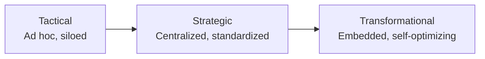

# AI and Agentic Maturity Rubric

This rubric provides detailed descriptions for each maturity phase across all dimensions. Use it to accurately identify your organization's current state and understand what advancement looks like.

## Quick Reference

| Score | Phase | Key Characteristics |
|-------|-------|---------------------|
| 1-2 | Tactical | Isolated pilots, reactive, manual, fragmented |
| 3-4 | Strategic | Centralized governance, standardized processes, proactive |
| 5 | Transformational | AI-first culture, automated pipelines, industry-leading |

---

## Dimension 1: Vision & Leadership

*The "What" and "Why" - Strategic alignment and executive commitment*

### Tactical Phase (Score 1-2)

| Aspect | Description |
|--------|-------------|
| **Vision** | Unclear, not centrally defined, ad hoc. AI arises from isolated problem solving or individual interest. |
| **Executive Sponsorship** | Little or no explicit executive sponsorship. C-suite may not be directly engaged. |
| **Funding** | Project-specific, opaque, drawn from fluctuating innovation or IT budgets. |
| **Governance** | Each project owner determines technical approach, governance, and ethics policies. Key stakeholders excluded. |
| **Focus** | Quick wins and proofs of concept. AI viewed as technology cost, not business driver. |
| **Outcome** | "Pilot purgatory" - projects succeed locally but fail to scale. |

### Strategic Phase (Score 3-4)

| Aspect | Description |
|--------|-------------|
| **Vision** | AI recognized as key competitive lever and strategic enabler. Well-articulated link to business outcomes. |
| **Executive Sponsorship** | Dedicated executive sponsorship and oversight. Clear accountability. |
| **Funding** | Dedicated multiyear budget for people, processes, and technology. |
| **Governance** | Centralized AI governance team or Center of Excellence. Risk assessments before deployment. |
| **Focus** | Clear path to scaling validated use cases. Standardization and reusability enforced. |
| **Outcome** | Moving from experiments to enterprise-wide products with measurable ROI. |

### Transformational Phase (Score 5)

| Aspect | Description |
|--------|-------------|
| **Vision** | AI embedded into business model itself, fundamentally redefining value creation and market position. |
| **Executive Sponsorship** | CEO is visible champion, articulating AI's role in company's future. |
| **Funding** | Investment in market advantage with rapid reallocation to high-potential opportunities. Long-term R&D standard. |
| **Governance** | Fully aware of high-stakes compliance (EU AI Act). Prepared for global governance standards. |
| **Focus** | Forward-looking, innovative, integrated with latest research and state-of-the-art. |
| **Outcome** | AI is default way to operate, driving sustained competitive advantage and shaping industry standards. |

---

## Dimension 2: Talent & Culture

*The "Who" - Workforce readiness and cultural openness*

### Tactical Phase (Score 1-2)

| Aspect | Description |
|--------|-------------|
| **Expertise** | Siloed knowledge, lack of cohesive strategy. Small number of individuals drive AI in isolation. |
| **Upskilling** | Limited to individuals or teams, not integrated into broader skill development programs. |
| **Hiring** | Reactive, based on ad hoc project needs. |
| **Collaboration** | Little structured collaboration between AI specialists, business units, and leadership. |
| **Culture** | Failed experiments seen negatively, stifling innovation. Most view AI as niche tool. |
| **Outcome** | Talent exists but independently of strategic mission to cultivate it. |

### Strategic Phase (Score 3-4)

| Aspect | Description |
|--------|-------------|
| **Expertise** | Defined strategy to recruit and retain AI expertise. Distinct career paths for AI professionals. |
| **Upskilling** | AI literacy programs and incentivized certifications available to wider range of employees. |
| **Hiring** | Proactive with AI-aligned hiring plan. |
| **Collaboration** | Structured change management program. Training focuses on human-AI collaboration. |
| **Culture** | Leadership promotes safe-to-fail environment. Employees view AI as augmentative, not replacement. |
| **Outcome** | Positive feedback loop - increased adoption leads to workforce ready to engage with AI. |

### Transformational Phase (Score 5)

| Aspect | Description |
|--------|-------------|
| **Expertise** | AI fluency is core competency across many roles, not just specialists. |
| **Upskilling** | Continuous training resources. Employees proactively identify AI opportunities to shape own roles. |
| **Hiring** | AI expertise is basic qualification across all leadership. |
| **Collaboration** | Human-AI collaboration is default operating model. Employees work alongside AI systems. |
| **Culture** | Continuous coevolution with AI. Adaptation to AI-driven change is part of cultural DNA. |
| **Outcome** | AI and agents are essential partners, deeply rooted in enterprise mission. |

---

## Dimension 3: Operational & Technical Practice

*The "How" - Execution capabilities across six subdomains*

### Subdomain 3.1: Data Quality, Accessibility, and Interoperability

| Phase | Description |
|-------|-------------|
| **Tactical** | Data siloed, unversioned, fragmented. Key features across local servers and legacy databases. Quality inconsistent, pipelines manual and one-off. Difficult to reproduce training datasets. |
| **Strategic** | Central data lake or mesh, often in cloud. Quality standards enforced. Automated, reusable pipelines. Feature stores used. Data centralized and governed. |
| **Transformational** | Data quality autonomously managed by agents that detect, flag, and remediate issues. Universally accessible with robust access control. Semantic layer provides instant access to governed data. |

### Subdomain 3.2: Engineering Processes and Best Practices

| Phase | Description |
|-------|-------------|
| **Tactical** | MLOps non-existent, manual, or non-reproducible. No standardized CI/CD/CT. Deployment from notebooks by individual developers. Varying levels of code annotation and version control. |
| **Strategic** | Standardized MLOps platform (e.g., Vertex AI). Full lifecycle defined and versioned. Automated CI/CD/CT mandatory with A/B and canary testing. Low-friction, repeatable deployments. |
| **Transformational** | AIOps in practice - agents autonomously retrain and redeploy based on triggers. Agent orchestration managed seamlessly with frameworks like ADK. Continuous monitoring with newest tools. |

### Subdomain 3.3: Evaluation, Monitoring, Explainability, and Product Lifecycle

| Phase | Description |
|-------|-------------|
| **Tactical** | Evaluation reactive and ad hoc. Minimal monitoring (only accuracy/latency). No production telemetry. No drift detection. Team lacks capability to explain or trace model reasoning. |
| **Strategic** | Proactive monitoring against pre-defined thresholds with alerting. Proxy business indicators measured. Central product management. Automated rollback integrated. Logging analytics for root cause. |
| **Transformational** | Monitoring for business value and ROI in real-time. Agents predict future decay and flag failures before they occur. A2H protocols for smart human escalation. |

### Subdomain 3.4: Safety, Security, Governance, and Risk Management

| Phase | Description |
|-------|-------------|
| **Tactical** | Passive security relying on general IT policies. No inference-layer controls for prompt injection, data leakage, or adversarial attacks. Ad hoc or absent access management. Reactive to issues. |
| **Strategic** | Technical guardrails and mandatory security gating embedded. Red teaming employed. Data de-identification applied. Dedicated review board signs off before production. CISO closely aligned. |
| **Transformational** | Security agents embedded in pipeline, enforcing privacy before code execution. Dynamic consent and provenance tracking default. Red/Blue/Purple team frameworks for continuous security. |

### Subdomain 3.5: Technical Tools, Frameworks, and Flexibility

| Phase | Description |
|-------|-------------|
| **Tactical** | Unmanaged tooling sprawl. Disparate unmanaged open source tools. Deployments suffer dependency issues. No standardization in packaging, serving, or security. Focus on model APIs and prompts only. |
| **Strategic** | Standardized, unified platform for AI workloads. Core frameworks and SDKs (e.g., ADK) used across teams with MCP and A2A integration. Containerized environments and standardized APIs. |
| **Transformational** | All agent capabilities exposed as APIs for external integration via A2A. Platform adapts to new technology automatically. Teams contribute to open source community. |

### Subdomain 3.6: FinOps Practices

| Phase | Description |
|-------|-------------|
| **Tactical** | Costs unallocated, resources overprovisioned. Bills arrive as one large expense. No resource tagging. Cost viewed as IT problem. Finance involved only during budgeting or unexpected bills. |
| **Strategic** | Mandatory resource tagging. Showback reports to project owners. Clear optimization policies (auto-shutdown, model sizing). Engineers, finance, and business review costs regularly. |
| **Transformational** | AI spend forecast based on usage and demand. FinOps agents autonomously trigger scaling and deployment changes. Financial optimization continuous. "Value-as-a-service" model. |

---

## Complete Rubric Matrix

### Vision & Leadership

| Aspect | Tactical (1-2) | Strategic (3-4) | Transformational (5) |
|--------|----------------|-----------------|----------------------|
| Vision/Roadmap | Ad hoc, isolated | Multiyear, centralized | Embedded in business model |
| Executive Alignment | Minimal | Active sponsorship | CEO as champion |
| Funding Model | Project-specific, fluctuating | Dedicated multiyear | Investment for market advantage |
| Governance | Per-project, siloed | Centralized CoE | Compliance-ready, proactive |
| Business Integration | Disconnected | OKR-aligned | Business model driver |

### Talent & Culture

| Aspect | Tactical (1-2) | Strategic (3-4) | Transformational (5) |
|--------|----------------|-----------------|----------------------|
| AI Expertise | Siloed individuals | Defined career paths | Core competency |
| Upskilling | Ad hoc, limited | Broad programs, incentivized | Continuous, self-directed |
| Collaboration | Minimal structure | Formal change management | Human-AI teaming default |
| Culture | Risk-averse, skeptical | Safe-to-fail encouraged | Continuous coevolution |
| AI Perception | Niche tool | Augmentation | Essential partner |

### Operational & Technical

| Subdomain | Tactical (1-2) | Strategic (3-4) | Transformational (5) |
|-----------|----------------|-----------------|----------------------|
| Data | Siloed, manual pipelines | Central lake, feature stores | Agent-managed, semantic layer |
| Engineering | Manual deployment, no CI/CD | Automated MLOps platform | AIOps, self-optimizing |
| Monitoring | Reactive, minimal | Proactive, threshold-based | Predictive, business-value focused |
| Security | Passive, reactive | Embedded guardrails, red teaming | Security agents, provenance tracking |
| Tools | Tooling sprawl | Standardized platform | API-first, A2A enabled |
| FinOps | Untracked, overprovisioned | Tagged, optimized | Autonomous cost agents |

---

## Worked Example: Cymbal Retail at Strategic Phase

*A multichannel retailer with an established AI Center of Excellence*

### Assessment

| Dimension | Aspect | Score | Evidence |
|-----------|--------|-------|----------|
| Vision | Roadmap | 4 | Multiyear AI roadmap tied to revenue goals |
| Vision | Funding | 4 | Dedicated AI budget, reviewed quarterly |
| Talent | Upskilling | 4 | 500+ managers in AI literacy program |
| Talent | Collaboration | 3 | CoE in place but business adoption uneven |
| Operations (Data) | | 4 | Centralized data lake with quality standards |
| Operations (Engineering) | | 3 | MLOps platform in place, some manual steps remain |
| Operations (Security) | | 3 | Red teaming initiated, not yet mandatory |
| Operations (FinOps) | | 3 | Cost tagging in place, optimization reactive |

### Summary

| Dimension | Average | Phase |
|-----------|---------|-------|
| Vision & Leadership | 4.0 | Strategic (Mature) |
| Talent & Culture | 3.5 | Strategic (Mid) |
| Operational & Technical | 3.3 | Strategic (Early) |
| **OVERALL** | **3.6** | **Strategic** |

### Next Steps for Cymbal Retail

To advance toward Transformational:
1. **Embed human-agent teaming** as default operating model
2. **Establish self-service agent creation** platform for non-developers
3. **Integrate AI ethics** into annual training and incentives
4. **Implement AIOps** for autonomous model management
5. **Deploy FinOps agents** for real-time cost optimization

---

## Using This Rubric

1. **Score each dimension** in the [maturity_assessment.md](./maturity_assessment.md)
2. **Match to phase descriptions** in this rubric to validate your scores
3. **Identify gaps** between current state and target state
4. **Prioritize improvements** based on organizational goals
5. **Use the roadmap template** in [roadmap_template.md](./roadmap_template.md) to plan transitions
