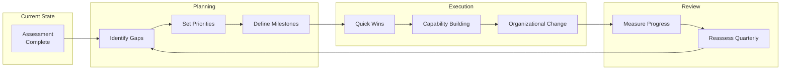
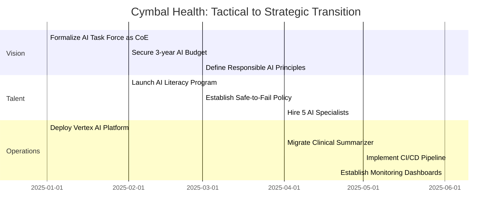

# AI Maturity Phase Transition Roadmap Template

This template helps organizations plan their journey between maturity phases. Use it after completing the [maturity assessment](./maturity_assessment.md) to create an actionable improvement plan.

## Roadmap Overview

---

## Phase Transition Checklists

### Tactical to Strategic Transition

Complete these foundational capabilities to move from Tactical to Strategic phase.

#### Vision & Leadership

| Milestone | Description | Owner | Status |
|-----------|-------------|-------|--------|
| Establish AI Center of Excellence | Centralized team to govern AI initiatives | | [ ] |
| Secure multiyear AI budget | Dedicated funding not tied to project cycles | | [ ] |
| Define AI governance framework | Policies for data, security, ethics, compliance | | [ ] |
| Document Responsible AI principles | Published, auditable principles with enforcement | | [ ] |
| Link AI roadmap to business OKRs | Clear connection between AI projects and business outcomes | | [ ] |
| Executive AI briefings | Quarterly updates to C-suite on AI progress | | [ ] |

#### Talent & Culture

| Milestone | Description | Owner | Status |
|-----------|-------------|-------|--------|
| Launch AI literacy program | Training available to all employees | | [ ] |
| Create AI career paths | Defined progression for AI/ML professionals | | [ ] |
| Establish safe-to-fail policy | Explicit governance for experiments | | [ ] |
| Form cross-functional AI teams | Structured collaboration between AI and business | | [ ] |
| Communicate AI augmentation message | Address replacement fears, emphasize augmentation | | [ ] |

#### Operational & Technical

| Milestone | Description | Owner | Status |
|-----------|-------------|-------|--------|
| Implement central data lake/mesh | Governed, accessible data foundation | | [ ] |
| Deploy MLOps platform | Standardized training, testing, deployment | | [ ] |
| Automate CI/CD pipelines | Continuous integration and deployment for ML | | [ ] |
| Establish monitoring and alerting | Proactive drift detection with thresholds | | [ ] |
| Integrate security into AI pipeline | Mandatory security review before deployment | | [ ] |
| Implement resource tagging for FinOps | Cost attribution by project/team | | [ ] |

---

### Strategic to Transformational Transition

Build on the Strategic foundation to achieve Transformational maturity.

#### Vision & Leadership

| Milestone | Description | Owner | Status |
|-----------|-------------|-------|--------|
| CEO champions AI publicly | AI integrated into corporate identity and messaging | | [ ] |
| Embed AI in business model | AI directly drives revenue or fundamentally changes operations | | [ ] |
| Establish proactive compliance | Ready for EU AI Act and global standards | | [ ] |
| Fund long-term AI R&D | Investment in emerging technologies and research | | [ ] |
| Democratize AI innovation | All business units empowered to propose AI solutions | | [ ] |

#### Talent & Culture

| Milestone | Description | Owner | Status |
|-----------|-------------|-------|--------|
| AI fluency in all leadership | AI competency required for executive hiring | | [ ] |
| Human-AI teaming as default | All roles designed around AI collaboration | | [ ] |
| Self-service agent creation | No-code tools for non-technical users | | [ ] |
| Annual AI ethics training | Embedded in performance incentives | | [ ] |
| Employee-driven AI proposals | Crowdsourcing AI ideas from all levels | | [ ] |

#### Operational & Technical

| Milestone | Description | Owner | Status |
|-----------|-------------|-------|--------|
| Implement AIOps | Agents autonomously manage model lifecycle | | [ ] |
| Deploy A2H protocols | Smart escalation to humans when needed | | [ ] |
| Enable A2A integration | Agent-to-agent communication across systems | | [ ] |
| Implement semantic layer | Universal governance for instant data access | | [ ] |
| Deploy FinOps agents | Autonomous cost optimization | | [ ] |
| Establish Red/Blue/Purple teams | Continuous AI security testing | | [ ] |

---

## Resource Allocation Planning

### People

| Role Category | Tactical Phase | Strategic Phase | Transformational Phase |
|---------------|----------------|-----------------|------------------------|
| Data Scientists | Ad hoc hiring | Dedicated team | Embedded in all BUs |
| ML Engineers | Contracted/outsourced | In-house team | Platform specialists |
| MLOps Engineers | Part-time/shared | Dedicated | AIOps focused |
| AI Product Managers | None | Central team | Distributed |
| AI Ethics/Governance | None | Dedicated role | Embedded function |
| Change Management | None | Project-based | Continuous |

### Process

| Capability | Tactical | Strategic | Transformational |
|------------|----------|-----------|------------------|
| Model Development | Ad hoc notebooks | Standardized pipeline | Automated with agents |
| Deployment | Manual | CI/CD | Self-optimizing |
| Monitoring | Reactive | Proactive | Predictive |
| Security Review | Post-hoc | Pre-deployment | Embedded agents |
| Cost Management | End of month | Weekly review | Real-time agents |

### Technology

| Component | Tactical | Strategic | Transformational |
|-----------|----------|-----------|------------------|
| Data Platform | Fragmented | Centralized | Agent-managed |
| ML Platform | Various tools | Vertex AI | AIOps platform |
| Agent Framework | Experiments | ADK standardized | A2A enabled |
| Monitoring | Basic logs | Dashboards | Predictive alerts |
| Security | Network perimeter | Inference-layer controls | Security agents |

---

## Success Criteria by Phase

### Tactical to Strategic Success Criteria

| Dimension | Metric | Target |
|-----------|--------|--------|
| Vision | % AI projects with documented business case | > 80% |
| Vision | Existence of multiyear AI budget | Yes |
| Talent | % employees with AI literacy training | > 50% |
| Talent | Number of failed experiments celebrated | > 3/year |
| Operations | Time to deploy new model (days) | < 14 |
| Operations | % models with automated monitoring | > 80% |
| Operations | % AI costs attributed to projects | 100% |

### Strategic to Transformational Success Criteria

| Dimension | Metric | Target |
|-----------|--------|--------|
| Vision | CEO public AI advocacy frequency | Quarterly |
| Vision | % revenue directly enabled by AI | > 20% |
| Talent | % leadership with AI fluency requirement | 100% |
| Talent | Employee-driven AI proposals per quarter | > 10 |
| Operations | % models with AIOps automation | > 50% |
| Operations | Mean time to detect drift (hours) | < 1 |
| Operations | FinOps cost deviation from target | < 5% |

---

## Worked Example: Cymbal Health Roadmap

*A healthcare payer transitioning from Tactical to Strategic phase.*

### Current State

| Dimension | Score | Phase |
|-----------|-------|-------|
| Vision & Leadership | 1.8 | Tactical |
| Talent & Culture | 1.5 | Tactical |
| Operational & Technical | 1.2 | Tactical |

### 12-Month Roadmap

### Key Milestones

| Quarter | Milestone | Success Criteria |
|---------|-----------|------------------|
| Q1 | CoE Established | Formal charter, dedicated budget approved |
| Q1 | Platform Selected | Vertex AI deployed in dev environment |
| Q2 | First Production Model | Clinical summarizer on MLOps platform |
| Q2 | AI Literacy Launch | 200+ employees enrolled |
| Q3 | CI/CD Operational | < 1 week deploy time |
| Q3 | Safe-to-Fail Published | Policy communicated company-wide |
| Q4 | Monitoring Mature | All models with automated alerts |
| Q4 | Reassessment | Average score > 3.0 |

### Resource Requirements

| Category | Investment | Notes |
|----------|------------|-------|
| People | 5 FTE hires | 2 ML Engineers, 2 Data Scientists, 1 MLOps |
| Platform | $500K/year | Vertex AI platform costs |
| Training | $200K | AI literacy program development |
| Consulting | $300K | CoE setup, governance framework |
| **Total Year 1** | **$1.5M + 5 FTE** | |

### Risks and Mitigations

| Risk | Likelihood | Impact | Mitigation |
|------|------------|--------|------------|
| Budget not approved | Medium | High | Build ROI case with clinical summarizer pilot |
| Talent shortage | High | Medium | Partner with university, use contractors initially |
| Resistance to change | Medium | Medium | Strong CEO messaging, celebrate early wins |
| Regulatory concerns | Low | High | Engage compliance early, document thoroughly |

---

## Quarterly Review Template

Use this template each quarter to track progress.

### Review Date: _______________

#### Progress Summary

| Dimension | Starting Score | Current Score | Change |
|-----------|----------------|---------------|--------|
| Vision & Leadership | | | |
| Talent & Culture | | | |
| Operational & Technical | | | |
| **OVERALL** | | | |

#### Milestones Completed

| Milestone | Planned Date | Actual Date | Notes |
|-----------|--------------|-------------|-------|
| | | | |
| | | | |

#### Milestones At Risk

| Milestone | Planned Date | Risk | Mitigation |
|-----------|--------------|------|------------|
| | | | |
| | | | |

#### Adjustments for Next Quarter

| Category | Adjustment | Rationale |
|----------|------------|-----------|
| | | |
| | | |

---

## Next Steps

1. **Complete assessment** using [maturity_assessment.md](./maturity_assessment.md)
2. **Identify your transition** (Tactical→Strategic or Strategic→Transformational)
3. **Complete relevant checklist** from this template
4. **Allocate resources** using the planning tables
5. **Set success criteria** and timeline
6. **Review quarterly** and adjust as needed
